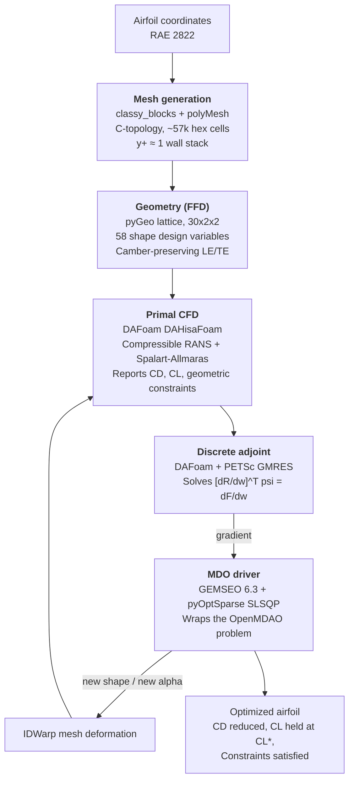

# Adjoint-Based Transonic Airfoil Shape Optimization

An end-to-end open-source pipeline for aerodynamic shape optimization of
the RAE 2822 airfoil under transonic conditions, driven by the discrete
adjoint of the compressible RANS equations. The MDO stack combines
OpenMDAO (differentiable discipline graph around DAFoam) with GEMSEO
(outer optimizer driver) and pyOptSparse SLSQP as the underlying
gradient-based algorithm.

Operating point: M = 0.729, Re = 6.5 × 10⁶, target C_L = 0.824
(same conditions as the ADODG Case 2 setup used by
He et al., *Aerospace Science and Technology* 87, 2019).

---

## What is in this repository

| Directory | Contents |
|---|---|
| [`mesh/`](mesh) | C-topology mesh generator (`classy_blocks` → OpenFOAM `polyMesh`), airfoil coordinate loader, mesh quality checks. |
| [`ffd/`](ffd) | Free-Form Deformation lattice generator (Plot3D ASCII) and diagnostic plots. |
| [`case/`](case) | OpenFOAM case: `system/`, `constant/`, `0_orig/`, `FFD/`, and the Python entry points — `dafoam_model.py` (the shared MPhys/OpenMDAO/DAFoam problem), `run_primal.py` (baseline primal), `verify_gradients.py` (adjoint verification), `run_at_shape.py` (post-optimization replay). |
| [`mdo/`](mdo) | The GEMSEO scenario driver — `dafoam_discipline.py` (Discipline wrapping the OpenMDAO problem) and `run_optimization.py` (formal MDO scenario). |
| [`airfoils/`](airfoils) | Reference RAE 2822 coordinates. |
| [`docs/`](docs) | Detailed technical report and companion notes. Start with [`docs/REPORT.md`](docs/REPORT.md). |
| [`results/`](results) | Backed-up run outputs (mesh, flow field, plots) for every completed run. |
| [`run_all.sh`](run_all.sh) | End-to-end pipeline script; run inside the DAFoam container from the repository root. |

## Workflow



A text version of the same diagram lives in
[`docs/WORKFLOW.md`](docs/WORKFLOW.md).

## Sample results

Benchmark preset (M = 0.729, Re = 6.5 × 10⁶, C_L\* = 0.824), 10 SLSQP
iterations, 4 MPI ranks. Cold-start comparison:

| Case | CD (counts) | CL | L/D |
|---|---:|---:|---:|
| Baseline (α = 2.8°, undeformed) | 183.8 | 0.788 | 42.9 |
| Optimized shape (α = 2.568°) | **157.2** | 0.803 | 47.8 |
| Reduction | **−26.6 counts (−14.5%)** | at target within tolerance | +11% |

The optimizer added camber near the leading edge and slightly reshaped
the upper crown, which weakened the shock on the suction side and
reduced wave drag.

Cp overlay (baseline grey, optimized colored):


Shape delta between baseline and optimized surfaces (peak `|Δy|` ≈ 3 mm
on a 1 m chord ≈ 0.3% chord — a small geometric change producing a
significant drag reduction):


## Detailed report

For a complete technical description of the workflow — problem
statement, software stack, component-by-component rationale, the
OpenMDAO + GEMSEO integration pattern, results, reproducibility
instructions, and known limitations — see:

**[`docs/REPORT.md`](docs/REPORT.md)**

## Quick start

Inside the DAFoam Docker container (see `docs/REPORT.md` § 8 for the
one-time environment setup and container commit):

```bash
# 1. Generate the mesh (outside the container is fine)
python mesh/generate_cmesh.py --case case --run
checkMesh -case case

# 2. Generate the FFD lattice
cd ffd && python generate_ffd.py && cd ..

# 3. Enter the DAFoam container and run the optimization
cd case
rm -f dRdWColoring_*.bin
rm -rf processor* 0
cp -r 0_orig 0

mpirun -np 4 python -u ../mdo/run_optimization.py \
    --preset benchmark --algo PYOPTSPARSE_SLSQP --max-iter 10 \
    > opt_log.txt 2>&1 &
tail -f opt_log.txt
```

Progress is also written to a live-updating markdown summary at
`case/opt_summary.md`.

## Dependencies

Runtime dependencies live inside the DAFoam container image
(`dafoam/opt-packages`): DAFoam v5, OpenFOAM v2506, MPhys, OpenMDAO,
pyGeo, IDWarp, pyOptSparse, PETSc4py, mpi4py. Add GEMSEO 6.3 and the
gemseo-pyoptsparse plugin on top:

```bash
pip install "numpy<2"
pip install "gemseo[all]>=6.3,<7"
pip install git+https://gitlab.com/gemseo/dev/gemseo-pyoptsparse.git@1.1.1
```

## License

The code in this repository is released under the MIT License. See the
individual upstream projects for their own licensing:
[DAFoam](https://dafoam.github.io/), [OpenMDAO](https://openmdao.org/),
[GEMSEO](https://gemseo.readthedocs.io/),
[pyOptSparse](https://mdolab-pyoptsparse.readthedocs-hosted.com/).

## Acknowledgements

The pipeline draws heavily from the DAFoam RAE 2822 tutorial and follows
the setup described in
He, Mader, Martins and Maki (2019),
*Robust aerodynamic shape optimization — from a circle to an airfoil*,
Aerospace Science and Technology, 87, 483-502 (their ADODG Case 2
subsection). This project is *not* a bit-for-bit reproduction of that
paper; see [`docs/REPORT.md`](docs/REPORT.md) § 7 for the comparison
between what matches and what differs.
