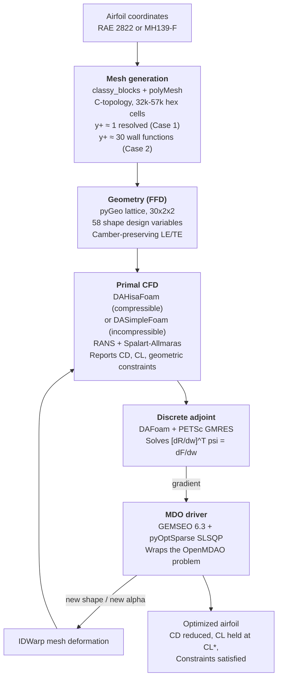
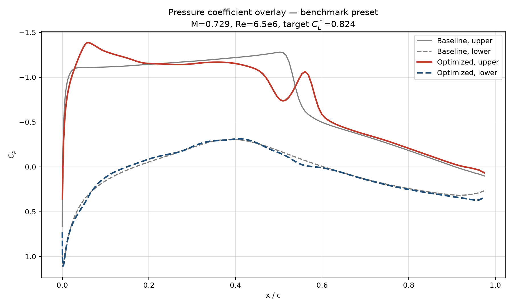
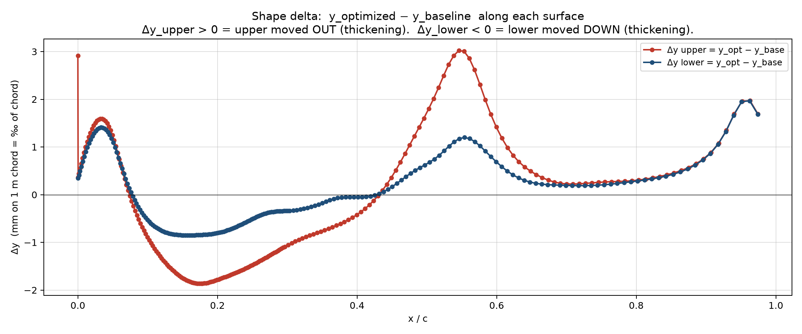
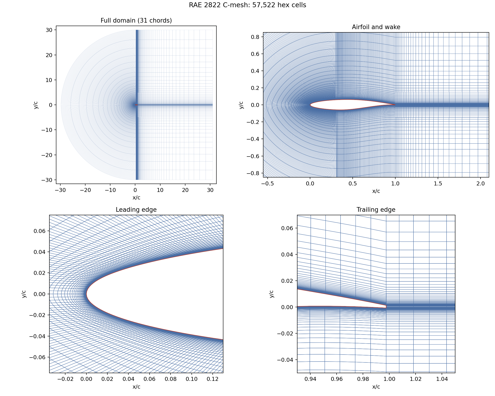
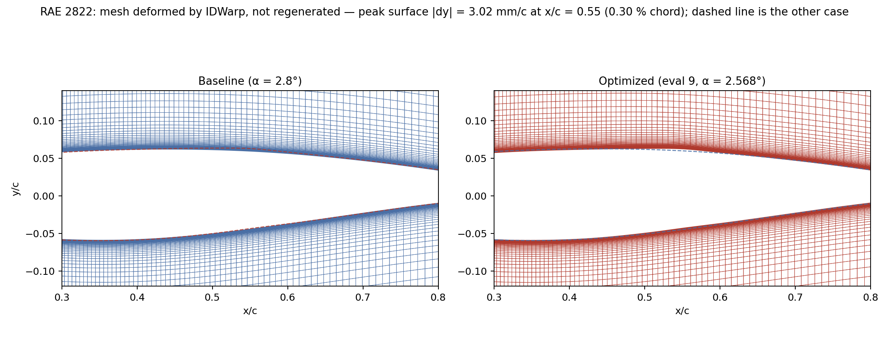
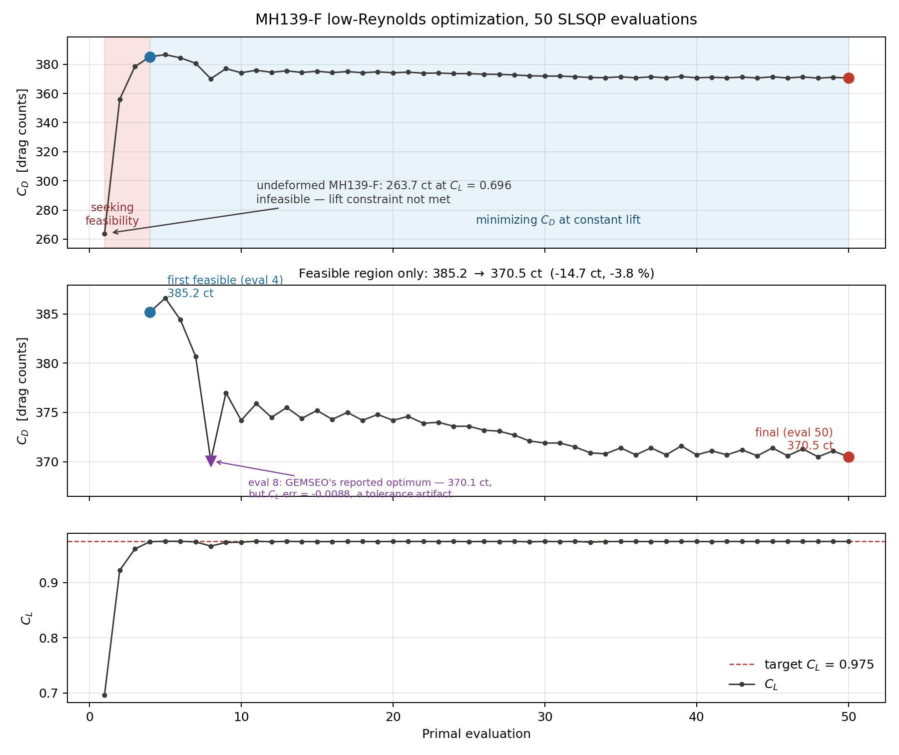
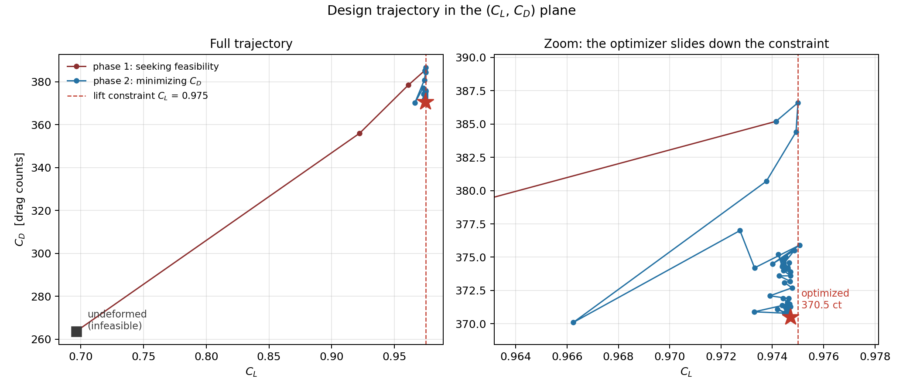
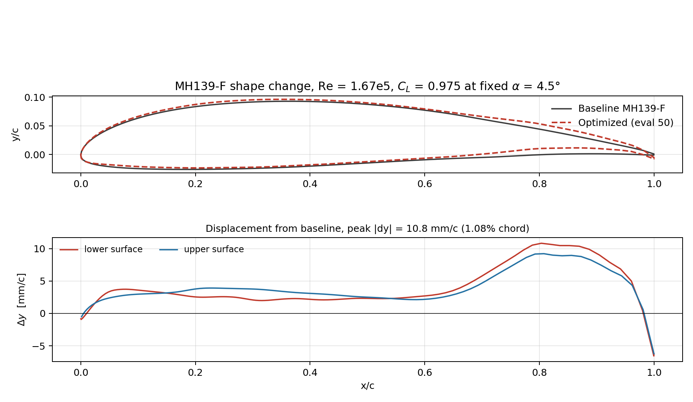
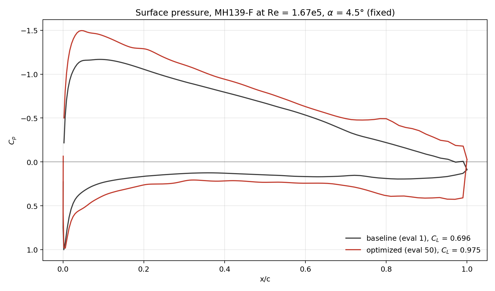
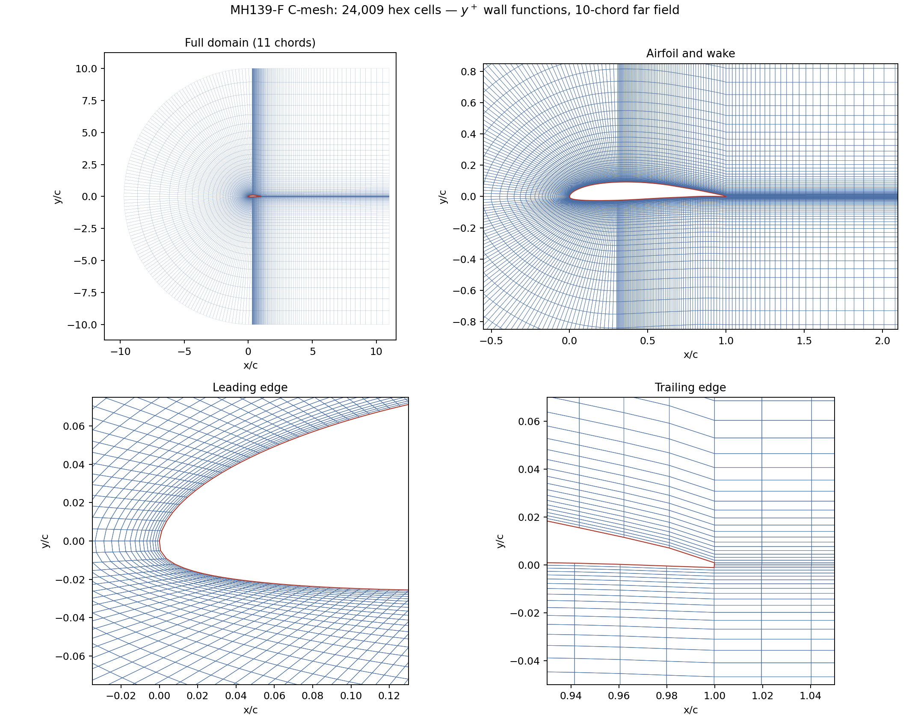

# Adjoint-Based Airfoil Shape Optimization

An end-to-end open-source pipeline for aerodynamic shape optimization, driven
by the **discrete adjoint** of the RANS equations. The MDO stack combines
OpenMDAO (differentiable discipline graph around DAFoam) with GEMSEO (outer
optimizer driver) and pyOptSparse SLSQP as the underlying gradient-based
algorithm.

The same pipeline is exercised on **two case studies in completely different
flow regimes**, separated by a factor of 40 in Reynolds number and a factor of
100 in Mach number:

| | **Case 1 — RAE 2822** | **Case 2 — MH139-F** |
|---|---|---|
| Regime | Transonic, shock-dominated | Incompressible, low-Reynolds |
| Mach | 0.729 | 0.0074 |
| Reynolds | 6.5 × 10⁶ | 1.67 × 10⁵ |
| Target C_L | 0.824 | 0.975 |
| Angle of attack | **Design variable** (0–10°) | **Fixed constraint** at 4.5° |
| Primal solver | `DAHisaFoam` (compressible) | `DASimpleFoam` (incompressible) |
| Design variables | 58 shape + α | 58 shape |
| Application | Transport-aircraft cruise | Solar UAV endurance cruise |
| Details | [Case 1 doc](docs/CASE_TRANSONIC_RAE2822.md) | [Case 2 doc](docs/CASE_LOWRE_MH139F.md) |

Only the primal solver and the design-space definition change between them.
The mesh generator, FFD parameterization, adjoint formulation and
GEMSEO/OpenMDAO bridge are shared code.

---

## What is in this repository

| Directory | Contents |
|---|---|
| [`mesh/`](mesh) | C-topology mesh generator (`classy_blocks` → OpenFOAM `polyMesh`), airfoil coordinate loader, Selig `.dat` splitter, boundary-layer sizing presets, mesh quality checks. |
| [`ffd/`](ffd) | Free-Form Deformation lattice generator (Plot3D ASCII) and diagnostic plots. |
| [`case/`](case) | **Case 1** OpenFOAM case (RAE 2822, transonic): `system/`, `constant/`, `0_orig/`, `FFD/`, plus `dafoam_model.py` (the shared MPhys/OpenMDAO/DAFoam problem), `run_primal.py`, `verify_gradients.py`, `run_at_shape.py`. |
| [`case_lale/`](case_lale) | **Case 2** OpenFOAM case (MH139-F, low-Re): same layout, incompressible numerics and boundary conditions. |
| [`mdo/`](mdo) | The GEMSEO scenario driver — `dafoam_discipline.py` (Discipline wrapping the OpenMDAO problem), `run_optimization.py` (formal MDO scenario), `archive_run.py` (run archiver). |
| [`airfoils/`](airfoils) | Reference coordinates: RAE 2822 and MH139-F. |
| [`docs/`](docs) | Technical documentation. Start with [`docs/REPORT.md`](docs/REPORT.md). |
| [`results/`](results) | Archived run outputs (config, mesh topology, design vectors, history plots) for every completed run. |
| [`postprocessing/`](postprocessing) | Cp, shape and history plotting scripts. |

## Workflow



A text version of the same diagram lives in
[`docs/WORKFLOW.md`](docs/WORKFLOW.md).

---

## Results

### Case 1 — RAE 2822, transonic

M = 0.729, Re = 6.5 × 10⁶, C_L\* = 0.824. 10 SLSQP iterations, 4 MPI ranks.
Cold-start comparison:

| Case | C_D (counts) | C_L | L/D |
|---|---:|---:|---:|
| Baseline (α = 2.8°, undeformed) | 183.8 | 0.788 | 42.9 |
| Optimized shape (α = 2.568°) | **157.2** | 0.803 | 47.8 |
| **Reduction** | **−26.6 counts (−14.5 %)** | at target within tolerance | **+11 %** |

The optimizer added camber near the leading edge and reshaped the upper crown,
weakening the suction-side shock and reducing wave drag.

Cp overlay (baseline grey, optimized coloured):



Shape delta between baseline and optimized surfaces — peak `|Δy|` = 3.02 mm on
a 1 m chord (0.30 % chord) at **x/c = 0.546**, inside the shock region. A small
geometric change producing a significant drag reduction:



The mesh — C-topology, 57 522 cells, 30-chord far field, wall-resolved to
y⁺ ≈ 1:



Baseline and optimized meshes over the shock region, each panel carrying the
other case's surface as a dashed line. At 0.3 % chord the deformation is
invisible in the mesh alone — IDWarp deforms the cells rather than
regenerating them, so the y⁺ ≈ 1 wall stack survives every design iteration:



> The raw SLSQP-reported reduction is −20.0 %. A cold-start replay of the
> optimum gives −14.5 %, and that is the figure quoted here. See
> [Case 1 doc § 5](docs/CASE_TRANSONIC_RAE2822.md#5-cold-start-verification)
> for why the two differ.

### Case 2 — MH139-F, low-Reynolds

Re = 1.67 × 10⁵, C_L\* = 0.975, α fixed at 4.5°. 50 SLSQP iterations,
6 MPI ranks, 8 h 37 m wall clock.

Because α is fixed, the undeformed MH139-F produces only C_L = 0.696 and
**never satisfies the lift constraint**. The run therefore splits into a
feasibility phase and an optimization phase, and the meaningful comparison is
between the first feasible design and the final one:

| Design | C_D (counts) | C_L | L/D | Feasible? |
|---|---:|---:|---:|:---:|
| Eval 1 — undeformed, α = 4.5° | 263.7 | 0.696 | 26.41 | **No** |
| Eval 4 — first feasible | 385.2 | 0.974 | 25.29 | Yes |
| Eval 50 — final | **370.5** | 0.975 | **26.31** | Yes |
| **Reduction (eval 4 → 50)** | **−14.7 counts (−3.8 %)** | held at target | **+4.0 %** | |

**Drag reduced by 14.7 counts at constant lift**, with all thickness, volume
and leading-edge-radius constraints satisfied. The design ends up
volume-limited — `volcon` sits exactly on its lower bound throughout.



The same run drawn in the (C_L, C_D) plane makes the two phases explicit —
the optimizer first walks right to reach the lift constraint, then walks down
along it:



Shape change, extracted from the deformed mesh at the final evaluation. The
optimizer added camber across the whole section with the largest displacement
near x/c ≈ 0.8 — aft loading, which is how it generates C_L = 0.975 without
being allowed to change the angle of attack:



The same story in the pressure field: suction peak deepens from −0.86 to
−1.50, and the aft upper surface stays loaded out to x/c ≈ 0.9 where the
baseline has already recovered. Stagnation C_p comes out at 1.0009 against an
exact 1.0, which is a useful check on the extraction:



The mesh — C-topology, 24 009 cells, wake block trailing the blunt TE, and a
leading-edge cluster deliberately coarsened relative to the transonic case:



> This case is a **pipeline demonstrator, not a benchmark**. It runs
> fully-turbulent Spalart-Allmaras, which cannot represent the laminar
> separation bubble that MH-series airfoils exhibit at Re ~ 10⁵, so absolute
> C_D is over-predicted. No comparison against XFOIL or wind-tunnel polars is
> offered, because that would measure the turbulence model rather than the
> optimizer. See [Case 2 doc § 1](docs/CASE_LOWRE_MH139F.md#1-scope-of-the-claim).

---

## Documentation

| Document | Contents |
|---|---|
| **[`docs/REPORT.md`](docs/REPORT.md)** | **Start here.** Shared pipeline methodology: software stack, component-by-component rationale, the OpenMDAO + GEMSEO integration pattern, reproducibility, limitations. |
| [`docs/CASE_TRANSONIC_RAE2822.md`](docs/CASE_TRANSONIC_RAE2822.md) | Case 1 in full — operating point, SLSQP trajectory, cold-start verification, physics, and a catalogued comparison to He et al. (2019). |
| [`docs/CASE_LOWRE_MH139F.md`](docs/CASE_LOWRE_MH139F.md) | Case 2 in full — operating point derivation, as-run non-dimensionalization, trajectory analysis, active constraint set, limitations. |
| [`docs/LALE_PROBLEM.md`](docs/LALE_PROBLEM.md) | Case 2 problem derivation and stage-by-stage implementation plan. |
| [`docs/WORKFLOW.md`](docs/WORKFLOW.md) | Workflow diagram, Mermaid and plain text. |
| [`docs/CP_PLOT_NOTES.md`](docs/CP_PLOT_NOTES.md) | Cp extraction algorithm and blunt-TE handling. |
| [`docs/CHANGES_LOG.md`](docs/CHANGES_LOG.md) | Chronological record of pipeline changes. |

---

## Quick start

One-time environment setup (Docker image, GEMSEO install, container commit) is
in [`docs/REPORT.md`](docs/REPORT.md) § 7.

### Case 1 — RAE 2822 (transonic)

Outside the container:

```bash
python mesh/generate_cmesh.py --case case --preset benchmark --run
checkMesh -case case
cd ffd && python generate_ffd.py --case ../case --preset benchmark && cd ..
```

Inside the DAFoam container:

```bash
cd case
rm -f dRdWColoring_*.bin
rm -rf processor* 0
cp -r 0_orig 0

mpirun -np 4 python -u ../mdo/run_optimization.py \
    --preset benchmark --algo PYOPTSPARSE_SLSQP --max-iter 10 \
    > opt_log.txt 2>&1 &
tail -f opt_log.txt
```

Expect roughly 27 hours at `--max-iter 10` on 4 ranks.

### Case 2 — MH139-F (low-Reynolds)

Outside the container:

```bash
python mesh/split_selig_dat.py airfoils/MH139-F.dat \
    --out-dir case_lale/profiles --stem MH139F
python mesh/generate_cmesh.py --case case_lale --preset lale --run
checkMesh -case case_lale
cd ffd && python generate_ffd.py --case ../case_lale --preset lale && cd ..
```

Inside the DAFoam container:

```bash
cd case_lale
rm -f dRdWColoring_*.bin
rm -rf processor* 0
cp -r 0_orig 0

mpirun -np 6 python -u ../mdo/run_optimization.py \
    --preset lale --algo PYOPTSPARSE_SLSQP --max-iter 50 \
    > opt_lale.log 2>&1 &
tail -f opt_lale.log
```

Expect roughly 8.6 hours at `--max-iter 50` on 6 ranks.

### Common

Progress is written to a live-updating markdown summary at
`<case>/opt_summary.md`. Archive a finished run with:

```bash
python mdo/archive_run.py --case case_lale
```

> The `dRdWColoring_*.bin` adjoint colouring cache is rank-count specific and
> must be deleted whenever the mesh, the FFD lattice, or the MPI rank count
> changes.

---

## Dependencies

Runtime dependencies live inside the DAFoam container image
(`dafoam/opt-packages`): DAFoam v5, OpenFOAM v2506, MPhys, OpenMDAO, pyGeo,
IDWarp, pyOptSparse, PETSc4py, mpi4py. Add GEMSEO 6.3 and the
`gemseo-pyoptsparse` plugin on top:

```bash
pip install "numpy<2"
pip install "gemseo[all]>=6.3,<7"
pip install git+https://gitlab.com/gemseo/dev/gemseo-pyoptsparse.git@1.1.1
```

`numpy < 2` is required because pyOptSparse 2.10.1 depends on `np.float_`,
which NumPy 2 removed.

## License

The code in this repository is released under the MIT License. See the
individual upstream projects for their own licensing:
[DAFoam](https://dafoam.github.io/), [OpenMDAO](https://openmdao.org/),
[GEMSEO](https://gemseo.readthedocs.io/),
[pyOptSparse](https://mdolab-pyoptsparse.readthedocs-hosted.com/).

## Acknowledgements

**Case 1** draws on the DAFoam RAE 2822 tutorial and follows the setup
described in He, Mader, Martins and Maki (2019), *Robust aerodynamic shape
optimization — from a circle to an airfoil*, Aerospace Science and Technology,
87, 483-502 (their ADODG Case 2 subsection). This project is *not* a
bit-for-bit reproduction of that paper; see
[`docs/CASE_TRANSONIC_RAE2822.md`](docs/CASE_TRANSONIC_RAE2822.md) § 7 for a
catalogued comparison of what matches and what differs.

**Case 2** takes its operating point from Oettershagen et al. (2017), *Design
of small hand-launched solar-powered UAVs*, Journal of Field Robotics, 34(7),
1352-1385 — specifically the AtlantikSolar UAV during its 81-hour endurance
flight. The paper supplies the aircraft; the section drag polar is entirely
this project's own computation and is not compared against published data.
</content>
