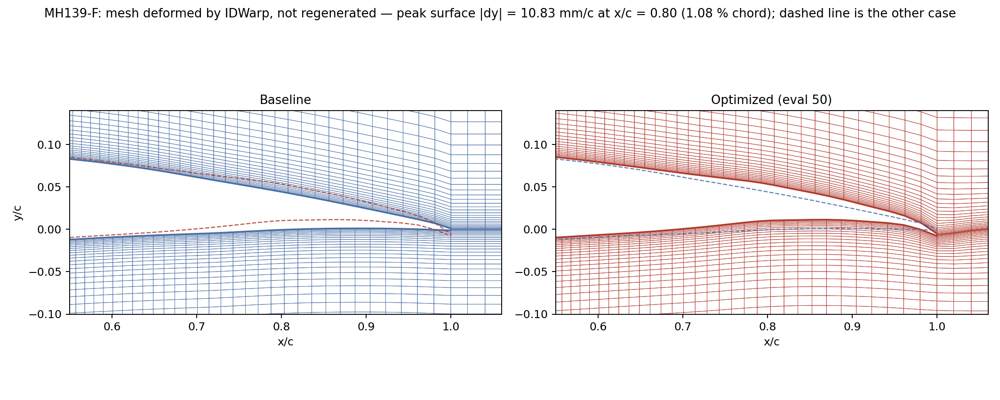
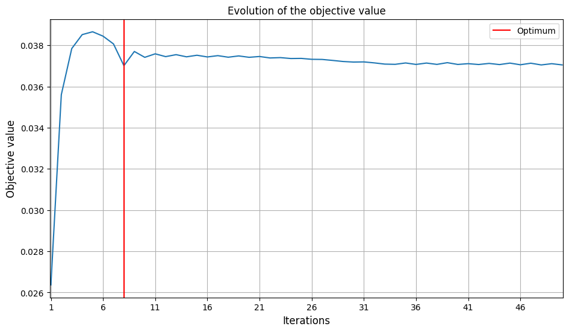
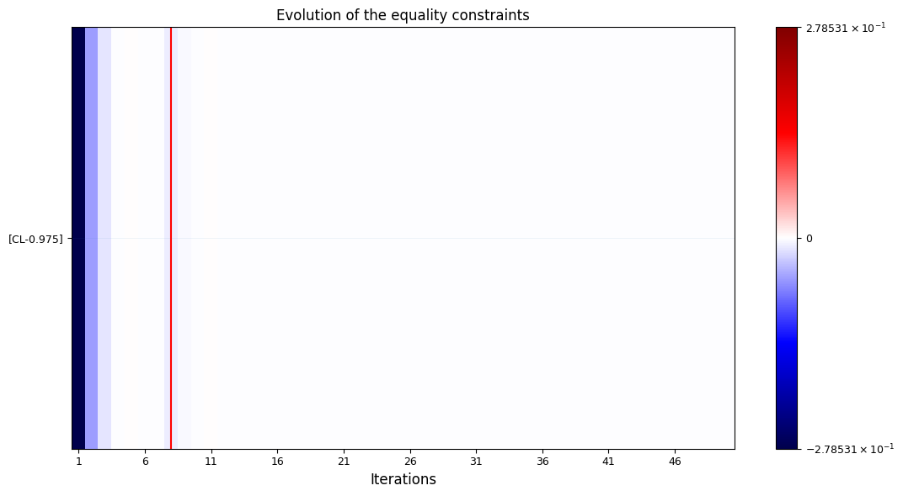
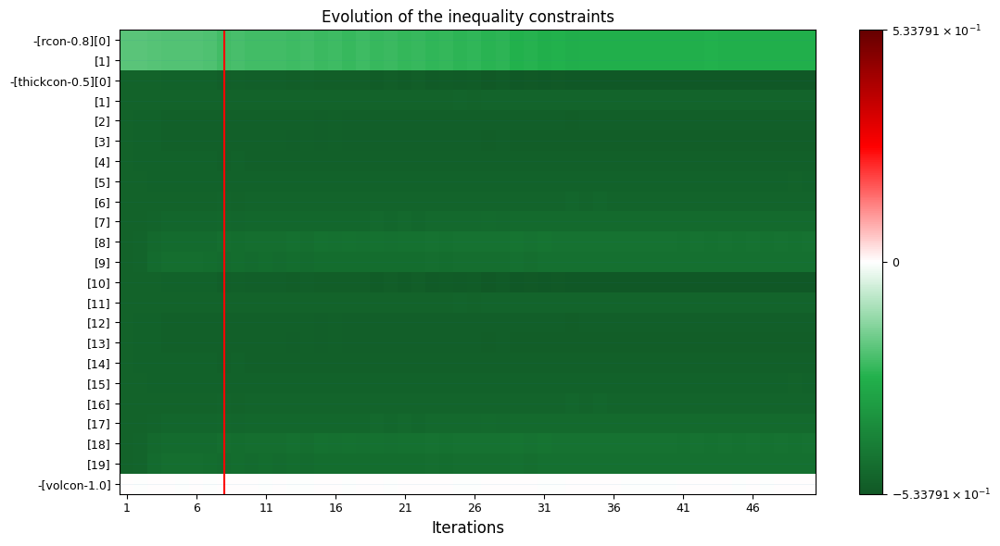

# Case Study 2 — Low-Reynolds Shape Optimization of the MH139-F

Single-point adjoint-based shape optimization of the **MH139-F** airfoil at
the cruise condition of a low-altitude long-endurance (LALE) solar UAV.

The pipeline is unchanged from [Case Study 1](CASE_TRANSONIC_RAE2822.md):
mesh → FFD → primal CFD → discrete adjoint → GEMSEO + pyOptSparse SLSQP.
The **physics regime is entirely different** — incompressible, Re ≈ 1.7 × 10⁵,
and the angle of attack is a fixed constraint rather than a design variable.

For the full derivation of the operating point and the implementation plan,
see [`LALE_PROBLEM.md`](LALE_PROBLEM.md). For the shared pipeline
description, see [`REPORT.md`](REPORT.md).

---

## Contents

1. [Scope of the claim](#1-scope-of-the-claim)
2. [Operating point](#2-operating-point)
3. [Optimization problem](#3-optimization-problem)
4. [What changed versus the transonic case](#4-what-changed-versus-the-transonic-case)
5. [Results](#5-results)
6. [Reading the trajectory](#6-reading-the-trajectory)
7. [Limitations](#7-limitations)
8. [Reproducing this run](#8-reproducing-this-run)
9. [References](#9-references)

---

## 1. Scope of the claim

**This case is a demonstrator of the pipeline at LALE Reynolds numbers. It is
not a reproduction of any published result, and it is not benchmarked against
external data.**

That constraint is deliberate and worth stating plainly:

- Oettershagen et al. (2017) supply the *aircraft*, from which the section
  lift target is derived. They report whole-aircraft power, **not** a section
  drag polar. There is no published section C_D to compare against.
- Published MH-series polars in general circulation are XFOIL results with
  e^N transition modelling. This study runs **fully-turbulent RANS with
  Spalart-Allmaras**. At Re ≈ 1.7 × 10⁵ a low-Re airfoil carries a long
  laminar run and a laminar separation bubble, neither of which SA can
  represent. Absolute C_D here is expected to be substantially over-predicted.
  Comparing the two would be measuring the turbulence model, not the
  optimizer.

Accordingly, **no absolute-accuracy claim is made about C_D**. What is claimed
is the *relative* result in § 5: at a fixed lift constraint and a fixed angle
of attack, the adjoint-driven optimizer reduced drag by a measurable margin
between two converged solutions of the same solver.

---

## 2. Operating point

Reference aircraft: **AtlantikSolar** solar-powered UAV (Oettershagen 2017),
during its 81-hour endurance flight.

| Symbol | Value | Source |
|---|---|---|
| Airfoil | MH139-F (custom low-Re, 11.6 % thick) | Oettershagen 2017 § 3.1 |
| Aircraft mass m | 6.93 kg | Table 1 |
| Weight W = m·g | 67.98 N | derived |
| Wing span b | 5.69 m | Table 1 |
| Wing chord c | 0.305 m | Table 1 |
| Wing area S = b·c | 1.735 m² | derived (rectangular wing, § 3.1) |
| Cruise airspeed U∞ | 8.30 m/s | measured average, § 4 |
| Altitude | 500 m ISA | our choice (near the Rafz test site, ≈ 430 m) |
| Air density ρ | 1.1673 kg/m³ | ISA at 500 m |
| Kinematic viscosity ν | 1.5196 × 10⁻⁵ m²/s | Sutherland at T = 284.90 K |
| **Reynolds number** | ρUc/μ = **1.666 × 10⁵** | derived |
| **Mach number** | 0.024 | derived — fully incompressible |
| **Angle of attack α** | **4.5° — fixed, NOT a design variable** | our choice |
| **Target C_L\*** | **0.975** | W / (½ρU²S) |

### 2.1 As-run non-dimensionalization

The CFD is run at **unit chord with the freestream velocity rescaled to match
Reynolds number**, not at the physical 0.305 m chord:

```
U_CFD = Re · ν / c_CFD = 1.666e5 × 1.5196e-5 / 1.0 = 2.531 m/s
```

| Quantity | Physical aircraft | As-run CFD |
|---|---:|---:|
| Chord | 0.305 m | 1.0 m |
| U∞ | 8.30 m/s | 2.531 m/s |
| Re | 1.666 × 10⁵ | 1.666 × 10⁵ |
| Mach | 0.024 | 0.0074 |
| Reference area A₀ | — | 0.01 m² (chord × 0.01 m slab span) |
| q∞ | — | 3.7403 Pa |

Reynolds number — the only similarity parameter that matters at this Mach —
is preserved exactly. Both Mach numbers are deep in the incompressible
regime, so the difference between them is immaterial.

> Note: this differs from § 1.5 of [`LALE_PROBLEM.md`](LALE_PROBLEM.md), which
> planned to mesh at the physical chord. The unit-chord form was adopted during
> implementation. This document records what was actually run.

---

## 3. Optimization problem

```
minimize      C_D(shape)
w.r.t.        shape ∈ [-0.02, 0.02]^58     (FFD y-displacements, m)
subject to    C_L(shape) = 0.975            (lift equality at α = 4.5°)
              thickcon(shape) ≥ 0.5         (per-station thickness ratio)
              volcon(shape)   ≥ 1.0         (airfoil-area ratio)
              rcon(shape)     ≥ 0.8         (LE radius ratio)
              α ≡ 4.5°  — constant, not a design variable
```

58 shape design variables from a 30 × 2 × 2 FFD lattice (28 × 2 interior
y-displacements plus 2 slaved LE/TE camber-preserving pairs).

**The fixed-α choice is what makes this problem interesting.** In the
transonic case the optimizer can trade angle of attack against shape to meet
the lift target cheaply. Here it cannot: the shape alone must generate
C_L = 0.975 at 4.5°, and the undeformed MH139-F only produces 0.696 there.
The optimizer must first *find* the feasible set, then move within it.

---

## 4. What changed versus the transonic case

| Component | Case 1 — RAE 2822 | Case 2 — MH139-F |
|---|---|---|
| CFD solver | `DAHisaFoam` (density-based compressible, JST) | **`DASimpleFoam`** (incompressible SIMPLE) |
| Fluid model | Compressible; T, ρ solved | Incompressible; ρ constant, no T |
| Pressure variable | Absolute p (Pa) | Kinematic p/ρ (m²/s²) |
| BC fields | U, p, T, nut, nuTilda, alphat | U, p, nut, nuTilda |
| Turbulence closure | SA | SA (same) |
| **Wall treatment** | **Wall-resolved, y⁺ ≈ 1, no wall functions** | **`nutUSpaldingWallFunction`, y⁺ ≈ 30** |
| Design vector | 58 shape + α = 59 | **58 shape only** |
| Mach | 0.729 | 0.0074 (as-run) |
| Re | 6.5 × 10⁶ | 1.67 × 10⁵ |
| Far-field extent | ≈ 30 chords | **10 chords** |
| Mesh | ~57 k hex cells | ~32–45 k hex cells |
| Case directory | `case/` | `case_lale/` |

The solver switch is required: density-based schemes with JST flux become
poorly conditioned as M → 0, and M = 0.0074 is far outside `DAHisaFoam`'s
usable range.

**The wall treatment also differs, and this is a substantive modelling
decision rather than a convenience.** Case 1 resolves the boundary layer to
the wall. Case 2 uses `nutUSpaldingWallFunction` with a y⁺ ≈ 30 first cell
(`dy1 ≈ 1.1 × 10⁻³`). The wall-resolved mesh was tried first and abandoned:
the y⁺ = 1 stack produced leading-edge cells with minimum volumes around
5 × 10⁻¹⁰, which drove a Spalart-Allmaras production runaway. The coarser
wall-function mesh — together with a reduced 10-chord far field, a coarser
LE cluster (`n_profile_pts = 100`, `n_circ_front = 60`) and retuned wake
spacing — is what made the case run stably. The cost of that trade is
recorded in § 7.

> The `## Solver Settings` block in this run's `opt_summary.md` states
> "wall-resolved (y+~1)". That line is a **stale hardcoded string in the
> summary writer** and does not describe the as-run configuration. The
> authoritative sources are `mesh/generate_cmesh.py` (`"y_plus": 30.0` in the
> `lale` preset), `case_lale/0_orig/nut` (`nutUSpaldingWallFunction` on the
> wing patch), and `case_lale/dafoam_model.py` (`"useWallFunction": True`).

---

## 5. Results

**Configuration.** 58 shape DVs, `PYOPTSPARSE_SLSQP`, `max_iter = 50`,
6 MPI ranks, DV bounds ± 0.02 m. Primal tolerances `stdTol = 1e-3`,
`slopeTol = 5e-6`, `primalMinIters = 8000`. Adjoint GMRES `gmresRelTol = 1e-6`,
`pcFillLevel = 1`. Mesh: C-topology, ~32–45 k hex cells, 10-chord far field,
`nutUSpaldingWallFunction` at y⁺ ≈ 30.

**Cost.** 50 primal evaluations, 27 adjoint solves, **8 h 37 m** wall clock,
averaging 10.3 min per primal.

**Termination.** `Maximum number of iterations reached. GEMSEO stopped the
driver.` The 50-iteration cap was hit; SLSQP did not converge on a KKT test.
The objective had nonetheless plateaued — see § 6.

### 5.1 Headline result

The run has two distinct phases. The meaningful comparison is between the
**first feasible design** and the **final design**, which share the same
constraint set and the same fixed α:

| Metric | Eval 4 — first feasible | Eval 50 — final | Change |
|---|---:|---:|---:|
| C_D | 0.038519 (385.2 ct) | **0.037049 (370.5 ct)** | **−14.7 ct (−3.8 %)** |
| C_L | 0.974143 (err −0.0009) | 0.974705 (err −0.0003) | held at target |
| L/D | 25.29 | **26.31** | **+4.0 %** |
| \|shape\| | 3.810 × 10⁻² | 4.431 × 10⁻² | — |
| thickcon min | 0.9663 | 0.9539 | PASS (≥ 0.5) |
| volcon | 1.0000 | 1.0000 | PASS (≥ 1.0), active |
| rcon min | 1.0047 | 1.0679 | PASS (≥ 0.8) |

**Drag reduced by 14.7 counts (3.8 %) at constant lift, with all geometric
constraints satisfied.**

*Choice of reference point:* eval 4 is the first evaluation whose lift error
falls below 10⁻³ — a tolerance 10× tighter than the `eq_tolerance = 0.01`
GEMSEO itself applies. Eval 5 hits the target exactly (err +0.0000) but at a
slightly higher C_D of 386.6 counts; quoting it would inflate the reported
improvement to 16.1 counts. Eval 4 is the conservative choice and is what
this document reports.

### 5.2 What the undeformed airfoil does — and why it is not the baseline

| | C_D | C_L | L/D | Feasible? |
|---|---:|---:|---:|:---:|
| Eval 1 — undeformed MH139-F, α = 4.5° | 263.7 ct | 0.696 | 26.41 | **No** — C_L err −0.2785 |
| Eval 4 — first feasible | 385.2 ct | 0.974 | 25.29 | Yes |
| Eval 50 — final | 370.5 ct | 0.975 | 26.31 | Yes |

The undeformed MH139-F produces only C_L = 0.696 at α = 4.5°. It **does not
satisfy the lift constraint** and is therefore not a valid point of
comparison. Drag rises from 263.7 to 385.2 counts across evals 1–4 not
because the optimizer failed, but because it is buying 40 % more lift — and
the profile drag of the added camber is the price.

> The `dCts` column in `opt_summary.md` reports **+106.4 counts** against
> eval 1. That number compares a feasible design to an infeasible one and
> should not be read as a performance regression.

### 5.3 A note on the reported optimum

GEMSEO reports the objective at exit as **0.037011 — eval 8**, not eval 50.

Eval 8 is admitted as feasible under GEMSEO's default `eq_tolerance = 0.01`,
but it undershoots the lift target by **−0.0088 (0.9 %)**, an order of
magnitude worse than the −0.0003 of the converged tail. That 0.9 % lift
shortfall is precisely what buys its 0.4-count drag advantage over eval 50.

**Eval 8 is a feasibility-tolerance artifact, not a better design.** This
document reports **eval 50** as the result. Tightening `eq_tolerance` to
~1e-4 would remove the ambiguity in a future run.

Related: the `## Final Result` block in `opt_summary.md` reports
`L/D final: 26.34`, which mixes eval 8's C_D with eval 50's C_L. The
self-consistent eval-50 value is **26.31**.

### 5.4 Convergence history

Drag and lift against evaluation number, with the two phases shaded:


The same run drawn as a path in the (C_L, C_D) plane. Phase 1 moves right to
reach the lift constraint; phase 2 moves down along it:


### 5.5 Shape change

Extracted directly from the deformed mesh at evaluation 50 (baseline from the
undeformed `polyMesh`, optimized reconstructed from the decomposed final flow
field):


Camber is added across the entire section, with the largest displacement —
about 10.8 mm on a 1 m chord, ≈ 1.1 % chord — centred near **x/c ≈ 0.8**.
That is aft loading, and it is the expected response to the problem as posed:
with α frozen at 4.5°, rear camber is the most efficient lever the optimizer
has for raising C_L. The trailing edge itself moves *down* by ≈ 6.5 mm,
increasing rear camber further.

Note that both surfaces move up together over most of the chord, so the
section is being re-cambered rather than thickened — consistent with `volcon`
sitting exactly on its lower bound (§ 6.1).

### 5.6 Surface pressure

Wall C_p for the undeformed baseline and the optimized section, both
extracted from their archived flow fields:


- **Stagnation C_p = 1.0009** at the leading edge on the baseline. The exact
  value is 1.0, so this is a useful check that the extraction is correct.
- **Suction peak deepens from −0.86 to −1.50** and moves forward — the direct
  consequence of the added leading-edge camber.
- **The aft upper surface holds around C_p ≈ −0.5 out to x/c ≈ 0.9**, where
  the baseline has already recovered to zero. This is the aft loading seen
  geometrically in § 5.5, now visible in the pressure field.
- The lower surface becomes uniformly more positive, adding to the loading.

The enclosed area between the two surfaces is the sectional lift; it is
visibly larger for the optimized section, consistent with C_L rising from
0.696 to 0.975 at unchanged α.

### 5.7 Mesh


C-topology, 24 009 cells in the 2D slab. The wake block trails the trailing
edge as parallel boundaries; the leading-edge cluster is deliberately
coarsened relative to the transonic case (§ 4), and the blunt trailing edge
added by `thicken_te()` is visible in the lower-right panel.

IDWarp deforms this mesh rather than regenerating it, so cell connectivity is
invariant across all 50 evaluations — which is what makes the archived
`polyMesh` topology reusable for every snapshot:



### 5.8 GEMSEO history plots

Raw optimizer-side views, written by GEMSEO's `OptHistoryView`:







Full archive: [`results/case_lale_20260806_084558/`](../results/case_lale_20260806_084558/).

**Every one of the 50 evaluations is retained in full** under
`optimization/saved/evalNNNN/` — the decomposed flow field (U, p, nut,
nuTilda, phi), the deformed mesh points, and the FFD coefficients, about
2.6 MB per evaluation. `eval0001` is the undeformed baseline; its geometry
matches the archived `polyMesh` to 1 × 10⁻¹², and `eval0050` matches the
final flow field exactly. Any evaluation can therefore be post-processed
after the fact without re-running CFD, which is how the pressure and mesh
figures below were produced.

---

## 6. Reading the trajectory

Condensed from the 50-row log in
[`opt_summary.md`](../results/case_lale_20260806_084558/optimization/opt_summary.md):

| Eval | \|shape\| | C_D (ct) | C_L | C_L err | L/D | Phase |
|---:|---:|---:|---:|---:|---:|:---|
| 1 | 0.000e+00 | 263.7 | 0.6965 | −0.2785 | 26.41 | infeasible start |
| 2 | 2.492e-02 | 356.0 | 0.9223 | −0.0527 | 25.90 | seeking feasibility |
| 3 | 3.387e-02 | 378.4 | 0.9610 | −0.0140 | 25.40 | seeking feasibility |
| **4** | 3.810e-02 | **385.2** | 0.9741 | **−0.0009** | 25.29 | **first feasible** |
| 5 | 3.829e-02 | 386.6 | 0.9750 | +0.0000 | 25.22 | exact target hit |
| 10 | 3.882e-02 | 374.2 | 0.9733 | −0.0017 | 26.01 | descending |
| 20 | 4.177e-02 | 374.2 | 0.9746 | −0.0004 | 26.05 | descending |
| 30 | 4.621e-02 | 371.9 | 0.9746 | −0.0004 | 26.21 | descending |
| 40 | 4.607e-02 | 370.7 | 0.9746 | −0.0004 | 26.29 | plateau |
| 45 | 4.369e-02 | 371.4 | 0.9747 | −0.0003 | 26.25 | plateau |
| **50** | 4.431e-02 | **370.5** | 0.9747 | −0.0003 | **26.31** | **final** |

Three things are visible:

**Feasibility first (evals 1–4).** SLSQP spends its first three steps driving
C_L from 0.696 to 0.974. Drag climbs monotonically — the optimizer is not
minimizing anything yet, it is finding the constraint surface.

**Descent at constant lift (evals 4–40).** With C_L pinned within 2 × 10⁻³ of
target, C_D falls 385.2 → 370.7 counts. The shape norm grows steadily from
3.8 × 10⁻² to 4.6 × 10⁻², well inside the ± 0.02 m box (a fully saturated
design vector would have norm 0.02 √58 ≈ 0.152, so the bounds are not active).

**Plateau (evals 40–50).** Eleven consecutive evaluations sit in a
370.5–371.6 count band — a 0.3 % spread — with lift error steady at 3 × 10⁻⁴.
The alternation between ~370.6 and ~371.3 is SLSQP line-search probing, not
progress. **This plateau, rather than the `max_iter` stop, is the evidence
that the run had converged in practice.**

### 6.1 Active constraint set

At the solution only two constraints bind:

- **C_L equality** — active by construction.
- **volcon = 1.0000** — held exactly at its lower bound for all 50
  evaluations. The design is **volume-limited**: the optimizer would reduce
  drag further by thinning the section, and is prevented from doing so.
- thickcon = 0.954 against a floor of 0.5 — slack by a wide margin.
- rcon = 1.068 against a floor of 0.8 — slack.

The binding volume constraint is the most likely lever for a follow-up study.

---

## 7. Limitations

- **Fully-turbulent SA at Re = 1.7 × 10⁵.** The dominant limitation. SA
  cannot represent the laminar run or the laminar separation bubble that
  MH-series airfoils exhibit at these conditions. Absolute C_D is
  over-predicted — plausibly by tens of counts. A transition-sensitive model
  (γ–Reθ, or an e^N-coupled approach) would be required for absolute
  accuracy. **The relative result in § 5.1 is between two solutions of the
  same solver and is not affected by this bias to first order.**
- **Wall functions at y⁺ ≈ 30, at a Reynolds number where they are a
  stretch.** `nutUSpaldingWallFunction` assumes a developed logarithmic
  layer. At Re = 1.7 × 10⁵ that layer is thin and poorly established, so the
  near-wall velocity profile — and therefore skin-friction drag, which is a
  large share of total drag at this Reynolds number — carries real modelling
  error. This was a stability-driven compromise (§ 4), not a preference. It
  compounds the fully-turbulent SA limitation above: both push in the
  direction of a mis-predicted friction drag. Adjoint sensitivities inherit
  the same bias, so the descent *direction* is more trustworthy than the
  absolute magnitudes.
- **Reduced far field (10 chords).** Against 30 chords for Case 1. Adequate
  for incompressible low-Re flow, but blockage and circulation-decay effects
  at 10 chords are not negligible for a lifting section and were not
  quantified with a domain-independence study.
- **Terminated on `max_iter`, not a KKT test.** The objective plateaued, but
  no formal optimality criterion was satisfied. A converged run would need a
  higher cap and a KKT-norm stopping test.
- **The reported optimum is eval 8 under a loose equality tolerance.** See
  § 5.3. `eq_tolerance` should be tightened to ~1e-4.
- **No feasible undeformed baseline.** Because α is fixed, the original
  MH139-F never satisfies the lift constraint, so no "original airfoil versus
  optimized airfoil" comparison exists in this study. § 5.1 compares first
  feasible against final instead.
- **2D uniform-loading assumption.** The section C_L target equals the wing
  C_L. Finite-wing corrections would raise the section target by 10–27 %;
  neglected, as is standard in 2D airfoil MDO.
- **Blunt trailing edge.** `classy_blocks` requires non-zero TE thickness, so
  `thicken_te()` adds ≈ 1 % chord of blunt base. This raises C_D slightly and
  produces a near-TE Cp artifact — see [`CP_PLOT_NOTES.md`](CP_PLOT_NOTES.md).
- **Single operating point.** No off-design or multipoint evaluation. An
  endurance aircraft spends its life across a speed range; a single-point
  optimum can be fragile off-design.

---

## 8. Reproducing this run

Environment setup (Docker image, GEMSEO install) is shared with Case 1 and
documented in [`REPORT.md`](REPORT.md) § 8.

Outside the container:

```bash
# Split the Selig .dat into suction/pressure profile files
python mesh/split_selig_dat.py airfoils/MH139-F.dat \
    --out-dir case_lale/profiles --stem MH139F

python mesh/generate_cmesh.py --case case_lale --preset lale --run
checkMesh -case case_lale

cd ffd && python generate_ffd.py --case ../case_lale --preset lale && cd ..
head -3 case_lale/FFD/wingFFD.xyz    # expect "30 2 2"
```

Inside the DAFoam container:

```bash
cd case_lale
rm -f dRdWColoring_*.bin
rm -rf processor* 0
cp -r 0_orig 0

mpirun -np 6 python -u ../mdo/run_optimization.py \
    --preset lale --algo PYOPTSPARSE_SLSQP --max-iter 50 \
    > opt_lale.log 2>&1 &
tail -f opt_lale.log
```

Live per-evaluation progress is written to `case_lale/opt_summary.md`.

Baseline primal only (≈ 5 min at 6 ranks):

```bash
mpirun -np 6 python -u run_primal.py --preset lale > baseline_lale.log 2>&1
```

Archive a completed run:

```bash
python mdo/archive_run.py --case case_lale
```

Add `--include-flow` to retain the processor decompositions (large), or
`--name <NAME>` to override the auto-generated archive directory name.

### 8.1 Cp post-processing

In incompressible OpenFOAM `p` is kinematic pressure (p/ρ), so the ParaView
Calculator expression differs from the transonic case:

```
Cp = p / (0.5 * U_CFD^2) = p / (0.5 * 2.531 * 2.531)
```

Procedure and blunt-TE trimming are in [`CP_PLOT_NOTES.md`](CP_PLOT_NOTES.md).

---

## 9. References

- Oettershagen, P., Melzer, A., Mantel, T., Rudin, K., Stastny, T.,
  Wawrzacz, B., Hinzmann, T., Leutenegger, S., Alexis, K., Siegwart, R.
  (2017). *Design of small hand-launched solar-powered UAVs: From concept
  study to a multi-day world endurance record flight*. Journal of Field
  Robotics 34(7), 1352–1385. DOI: 10.1002/rob.21717.
- Hepperle, M. — MH series of low-Reynolds airfoils.
  http://www.mh-aerotools.de/airfoils/
- Spalart, P.R., Allmaras, S.R. (1992). *A One-Equation Turbulence Model for
  Aerodynamic Flows*. AIAA Paper 92-0439.
- Shared software-stack references are listed in [`REPORT.md`](REPORT.md) § 10.

### Companion documents

- [`LALE_PROBLEM.md`](LALE_PROBLEM.md) — operating-point derivation and the
  full implementation plan for this case.
- [`REPORT.md`](REPORT.md) — shared pipeline methodology.
- [`CASE_TRANSONIC_RAE2822.md`](CASE_TRANSONIC_RAE2822.md) — Case Study 1.
- [`CP_PLOT_NOTES.md`](CP_PLOT_NOTES.md) — Cp extraction and blunt-TE handling.
</content>
