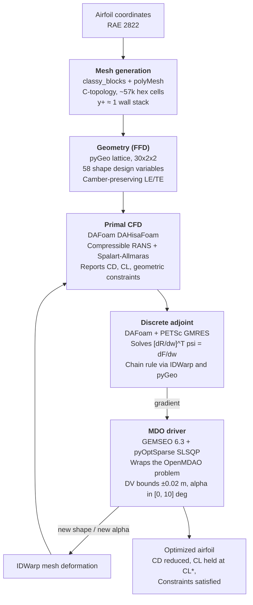

# Adjoint-Based Transonic Airfoil Shape Optimization

A single-point aerodynamic shape-optimization study of the RAE 2822
airfoil under transonic conditions. Uses a discrete-adjoint RANS solver
combined with a dual-framework MDO stack (OpenMDAO for the differentiable
discipline graph, GEMSEO for the outer optimizer driver).

## Disclaimer

**This project is not a bit-for-bit reproduction of any published paper.**
It draws inspiration from He, Mader, Martins and Maki (2019),
*Robust aerodynamic shape optimization — from a circle to an airfoil*,
Aerospace Science and Technology 87, 483-502 (specifically their ADODG
Case 2 setup for RAE 2822). The intent was to build an end-to-end
open-source adjoint MDO pipeline on top of DAFoam, exercise it on the
same operating point that the paper uses, and understand where a
practical DAFoam+GEMSEO+SLSQP stack lands relative to a rigorous
ADflow+SNOPT setup.

Several parts of the pipeline are deliberately different from the paper:

| Aspect | Paper (He 2019) | This project |
|---|---|---|
| CFD solver | ADflow (structured multi-block, ANK/NK Newton-Krylov) | DAFoam v5 / DAHisaFoam (density-based FVM on polyMesh) |
| Mesh | O-mesh with knife-edge TE | C-mesh with 1% chord blunt TE (`classy_blocks` needs a non-zero TE) |
| Optimizer | SNOPT (commercial) | pyOptSparse SLSQP (free) via GEMSEO 6.3 |
| Outer framework | OpenMDAO + pyOptSparse directly | GEMSEO wraps OpenMDAO |
| Primal convergence | Density residual 10⁻¹⁵ | CD std ≤ 0.01, slope ≤ 5e-5, primalMinIters=8000 |
| SNOPT / SLSQP tolerances | opt=10⁻⁶, step=10⁻³, Hessian=50 | GEMSEO defaults (ftol_rel=10⁻⁶, eq_tolerance=10⁻²) |
| Iterations to termination | ~500 (from paper Fig. 11) | 10 (max_iter cap) |

Same in both:

- **Operating point**: M = 0.729, Re = 6.5 × 10⁶, C_L\* = 0.824
- **Turbulence model**: Spalart-Allmaras, low-Re (wall-resolved)
- **Numerical flux**: JST
- **Shape parameterization**: Free-Form Deformation (FFD) with camber-preserving LE/TE constraints
- **Constraint set**: thickness, volume, LE radius

Everything called "verified from the paper" below cites the specific
page of `He2019c.pdf` where the fact appears. Everything else is my own
implementation choice; the accompanying reasoning is stated.

## Contents

1. [Objectives](#1-objectives)
2. [Software stack](#2-software-stack)
3. [Workflow](#3-workflow)
4. [Components](#4-components)
5. [OpenMDAO + GEMSEO integration](#5-openmdao--gemseo-integration)
6. [Results](#6-results)
7. [Discussion — comparison to the paper](#7-discussion--comparison-to-the-paper)
8. [Reproducibility](#8-reproducibility)
9. [Limitations](#9-limitations)
10. [References](#10-references)

---

## 1. Objectives

1. Build an end-to-end differentiable aerodynamic design loop using
   open-source software.
2. Use the discrete adjoint of the compressible RANS equations to obtain
   gradients of the drag coefficient with respect to shape design
   variables at a cost independent of the number of design variables.
3. Use GEMSEO as the outer MDO framework while preserving the mature
   OpenMDAO/MPhys integration underneath DAFoam.
4. Run the pipeline at the operating point of He et al. (2019) ADODG
   Case 2 and honestly assess where the result lands.

Non-goals: multipoint optimization, unsteady effects, aeroelastic
coupling, uncertainty quantification. All are natural extensions.

---

## 2. Software stack

Thirteen packages arranged across four layers.

### 2.1 CFD and adjoint core

| Package | Role |
|---|---|
| **OpenFOAM v2506** | Underlying finite-volume CFD framework — mesh format, boundary condition machinery, runtime function objects. |
| **DAFoam v5** | Adds a discrete adjoint layer to OpenFOAM. Provides `DAHisaFoam` (compressible primal), automatic assembly of the transposed residual Jacobian, PETSc-backed GMRES, and the OpenMDAO/MPhys integration hooks. |
| **PETSc4py** | Python bindings for PETSc; supplies the Krylov solvers, sparse matrix operations, and parallel linear algebra that DAFoam uses under the hood. |
| **mpi4py** | MPI bindings enabling parallel decomposition of both primal and adjoint solves across CPU cores. |

### 2.2 Geometry and mesh manipulation

| Package | Role |
|---|---|
| **pyGeo** | Free-Form Deformation with analytic derivatives. Manages design-variable definitions, geometric constraints, and surface embedding. Chosen because it is tightly integrated with DAFoam via MPhys. |
| **IDWarp** | Inverse-Distance Weighted volume-mesh warping under surface deformation. Preserves the near-wall stack (essential for y⁺ ≈ 1 meshes) and provides analytic sensitivities. |

### 2.3 MDO frameworks (both used together — see § 5)

| Package | Role |
|---|---|
| **OpenMDAO** | Component-based MDO framework from NASA/MDOLab. Substrate DAFoam is built on: mesh subsystem, geometry component, aerodynamic scenario, and functionals are all OpenMDAO components. |
| **MPhys** | Multi-physics scenarios built on OpenMDAO. Provides the `Multipoint`, `ScenarioAerodynamic`, and standard adaptors that make the mesh → geometry → warp → CFD → functional path plug together. |
| **GEMSEO** | Multi-Disciplinary Analysis and Optimisation framework from IRT SystemX / Airbus. Provides Discipline abstraction, design-space representation, MDO formulations, scenario execution engine, and post-processing. |
| **gemseo-pyoptsparse** | Bridge plugin: registers pyOptSparse's optimizers inside GEMSEO's algorithm library. |
| **pyOptSparse** | Unified interface to a suite of gradient-based and gradient-free constrained optimizers. Its SLSQP wrapper is well-tested for CFD shape optimization. |

### 2.4 Supporting libraries

`numpy < 2` (pyOptSparse 2.10.1 depends on `np.float_`, removed in NumPy 2),
`scipy`, and Python 3.10 (the interpreter shipped in the DAFoam Docker
image).

---

## 3. Workflow



The airfoil coordinates enter mesh generation. The FFD lattice wraps the
airfoil surface and exposes 58 y-displacement design variables. The
primal solver advances the RANS equations to steady state and integrates
force coefficients. The discrete adjoint delivers exact gradients at
cost independent of the design-variable count. GEMSEO (wrapping the
OpenMDAO problem) proposes a new design via SLSQP and closes the loop by
sending the new shape and angle of attack back through IDWarp.

---

## 4. Components

### 4.1 Mesh generation

A 2D C-topology hex mesh around the RAE 2822, converted to OpenFOAM
polyMesh format. The boundary layer is resolved to the wall (no wall
functions) with y⁺ ≈ 1. Far field extends approximately 30 chords.

**Choice: C-topology.** Wraps around the LE and trails the wake as
parallel block boundaries. Standard for airfoil CFD.

**Choice: wall-resolved.** Adjoint sensitivities to skin-friction drag
are significant at transonic Reynolds. Wall functions would introduce
empirical error that pollutes gradients.

**Cell count history.** Started at 99k cells with a mild radial expansion
ratio. The adjoint chain-rule step exceeded 28 GB of WSL memory and
caused the container to OOM. Rebuilding with a slightly more aggressive
expansion ratio produced a 57k-cell mesh with unchanged quality metrics
(non-orthogonality 60, skewness 0.40).

Files: `mesh/generate_cmesh.py`, `case/constant/polyMesh/`.

### 4.2 Geometry parameterization

Trivariate B-spline FFD lattice, 30 × 2 × 2 control points. Interior
28 × 2 y-displacements + 2 slaved LE/TE pairs give 58 free shape design
variables.

**Choice: FFD.** Smooth deformation over the whole surface, analytic
`dX/dP`, low-dimensional design vector.

**Camber-preservation constraint.** LE and TE control points are slaved
so their upper and lower siblings move in opposite directions. Removes
two rigid-body y-translation modes.

**Design-variable bounds ±0.02 m (± 2% chord).** Initially set at ±1.0 m
following the DAFoam tutorial defaults, but the first SLSQP descent step
at those bounds destroyed the y⁺ ≈ 1 wall stack. 2% chord is generous by
shape-design standards.

Files: `ffd/generate_ffd.py`, `case/FFD/wingFFD.xyz`, `case/dafoam_model.py`.

### 4.3 Primal CFD

Steady compressible RANS with Spalart-Allmaras closure via DAFoam's
`DAHisaFoam` solver (density-based, JST convective flux).

**Choice: density-based.** Required for shock capture at M = 0.729.

**Choice: JST flux.** Robust for moderate-shock strengths encountered.

**Choice: Spalart-Allmaras, low-Re.** Standard reference model for
airfoil aerodynamics; matches the paper.

**Auto-stop tolerances.** `primalMinIters = 8000`, `stdTol = 0.01`,
`slopeTol = 5e-5`, `nStepsFrac = 0.2`. Tuned progressively over many
runs from `100 / 0.1 / 1e-3` upward.

Files: `case/dafoam_model.py`, `case/system/`, `case/run_primal.py`.

### 4.4 Discrete adjoint

Solves `[∂R/∂w]ᵀ ψ = ∂F/∂w` for the adjoint state ψ, then applies the
chain rule for total derivatives `dF/dx = ∂F/∂x − ψᵀ ∂R/∂x`.

**Rationale.** For 58 design variables, finite differences would need
59 primal solves per gradient evaluation. The discrete adjoint costs
one linear solve per functional regardless of the design-variable
count.

**Linear solver.** PETSc GMRES, additive Schwarz preconditioner, ILU-1
fill, natural reordering. `gmresRelTol = 1e-6`. Typical GMRES converges
in 600-800 iterations per functional.

**Coloring cache.** DAFoam caches the graph coloring in
`dRdWColoring_<nranks>.bin`. Must be deleted whenever the mesh or FFD
changes.

Files: `case/dafoam_model.py`, `case/verify_gradients.py`.

### 4.5 MDO driver

Solves the constrained non-linear program

```
minimize      CD(s, alpha)
w.r.t.        s in [-0.02, 0.02]^58 m,  alpha in [0, 10] deg
subject to    CL(s, alpha) = CL*
              thickcon(s) >= 0.5, volcon(s) >= 1.0, rcon(s) >= 0.8
```

via SLSQP from pyOptSparse, driven by GEMSEO, evaluating the OpenMDAO
problem underneath. Details in the next section.

Files: `mdo/dafoam_discipline.py`, `mdo/run_optimization.py`.

---

## 5. OpenMDAO + GEMSEO integration

The combination of OpenMDAO and GEMSEO in one pipeline is unusual.

### 5.1 Strategic choice

Three options were on the table:

1. **Pure OpenMDAO + pyOptSparse** — what the paper does. Simple.
   Downside: does not fulfil the project's stated goal of using GEMSEO.
2. **Pure GEMSEO** — port DAFoam's discipline set natively to GEMSEO
   Discipline classes. Very substantial engineering effort.
3. **GEMSEO drives OpenMDAO** — wrap the entire OpenMDAO Problem in a
   single GEMSEO Discipline. GEMSEO handles design space, formulation,
   and optimizer. OpenMDAO handles internal derivatives and DAFoam
   integration.

Option 3 was chosen. It preserves DAFoam's mature OpenMDAO integration
and adds GEMSEO's cleaner MDO abstractions on top.

### 5.2 How the frameworks interlock

```
GEMSEO scenario                     OpenMDAO problem
(formulation, design space,         (owned inside the
 optimizer, execute loop)            DAFoamDiscipline)
        |                                    |
        | scenario.execute(algo=...)          | prob.run_model()
        v                                    v
DAFoamDiscipline._run                  MPhys ScenarioAerodynamic
   prob.set_val("shape", s)             mesh (DAFoamBuilder)
   prob.set_val("patchV", ...)          geometry (OM_DVGEOCOMP)
   prob.run_model()                     coupling (DAFoamSolver)
   return {CD, CL, ...}                 aero_post (functionals)

DAFoamDiscipline._compute_jacobian
   prob.compute_totals(of=[...],
                       wrt=[...])       (runs the adjoint per F,
                                        chain rule inside OpenMDAO)
   self.jac[out][in] = totals[...]
```

Key files:

- `mdo/dafoam_discipline.py` - the bridge (~ 60 lines of substantive glue)
- `mdo/run_optimization.py` - the GEMSEO scenario definition
- `case/dafoam_model.py` - the OpenMDAO problem itself

### 5.3 What the bridge does not do

- It does not translate MPhys scenarios into GEMSEO. The OpenMDAO
  problem lives entirely inside the GEMSEO discipline; GEMSEO sees only
  input/output vectors and the analytic Jacobian.
- It does not use GEMSEO's own derivative propagation. All internal
  derivatives (from CD to shape) are computed inside OpenMDAO.
- It does not multiply-instantiate the DAFoam problem. Build once in
  `__init__`; reuse across all optimizer iterations.

### 5.4 API version notes

- GEMSEO 5.x → 6.x rename map: `MDODiscipline` → `Discipline`,
  `local_data` → `io.data`, `default_inputs` → `io.input_grammar.defaults`,
  `_run(self)` + `store_local_data(**out)` → `_run(input_data)` that
  returns a dict, `_init_jacobian(with_zeros=True)` → `_init_jacobian(...)`.
- `gemseo-pyoptsparse` 1.1.1 rejects any pyOptSparse-native setting name
  that has a GEMSEO-canonical counterpart. Pass only `max_iter` plus
  GEMSEO-standard tolerance names.

---

## 6. Results

### 6.1 Setup

Operating conditions (`benchmark` preset in `case/dafoam_model.py`):

| Parameter | Value |
|---|---:|
| U_∞ | 248.08 m/s |
| p_∞ | 39 011 Pa |
| T_∞ | 288.15 K |
| ρ_∞ | 0.472 kg/m³ |
| M | 0.729 |
| Re per chord | 6.5 × 10⁶ |
| C_L\* | 0.824 |
| Initial angle of attack | 2.8 deg |

Configuration: 58 shape design variables (FFD 30 × 2 × 2), 57k-cell
mesh, `PYOPTSPARSE_SLSQP`, `max_iter = 10`, 4 MPI ranks, DV bounds
± 0.02 m.

### 6.2 SLSQP trajectory (10 evaluations)

| Eval | Kind | \|shape\| (m) | α (°) | CD | Counts | Δcts | CL | L/D | Wall (min) |
|---:|:---:|---:|---:|---:|---:|---:|---:|---:|---:|
| 1 | base | 0.000e+00 | 2.800 | 0.018385 | 183.8 | 0.0   | 0.788 | 42.9 | 96  |
| 2 | eval | 1.775e-03 | 2.934 | 0.019400 | 194.0 | +10.2 | 0.827 | 42.6 | 124 |
| 3 | eval | 6.728e-03 | 2.638 | 0.016417 | 164.2 | −19.7 | 0.799 | 48.6 | 133 |
| 4 | eval | 5.322e-03 | 2.687 | 0.016149 | 161.5 | −22.4 | 0.815 | 50.5 | 139 |
| 5 | eval | 6.748e-03 | 2.675 | 0.015942 | 159.4 | −24.4 | 0.822 | 51.6 | 155 |
| 6 | eval | 1.237e-02 | 2.461 | 0.018022 | 180.2 | −3.6  | 0.784 | 43.5 | 177 |
| 7 | eval | 7.895e-03 | 2.629 | 0.015251 | 152.5 | −31.3 | 0.825 | 54.1 | 153 |
| 8 | eval | 2.033e-02 | 2.136 | 0.025661 | 256.6 | +72.8 | 0.676 | 26.3 | 156 |
| **9** | **eval** | **9.385e-03** | **2.568** | **0.014713** | **147.1** | **−36.7** | **0.826** | **56.2** | 162 |
| 10 | eval | 1.662e-02 | 2.256 | 0.022346 | 223.5 | +39.6 | 0.721 | 32.3 | 166 |

SLSQP's typical exploration-exploitation pattern is visible: descent
steps (Evals 3-5, 7, 9) are punctuated by aggressive probes that violate
the CL equality (6, 8, 10) and get rejected. Eval 9 is the deepest CD
achieved that also satisfies all constraints. Eval 10 is SLSQP's final
line-search probe.

### 6.3 Reported optimum (Eval 9)

| Metric | Baseline (Eval 1) | Optimized (Eval 9) | Change |
|---|---:|---:|---:|
| CD | 0.018385 (183.8 cts) | **0.014713 (147.1 cts)** | **−36.7 cts (−20.0%)** |
| CL | 0.788 | 0.826 (target 0.824, error +0.002) | at target |
| L/D | 42.9 | 56.2 | +31% |
| angle of attack | 2.800° | 2.568° | −0.232° |
| thickcon min | 1.000 | 0.991 | PASS |
| volcon | 1.000 | 1.000 | PASS |
| rcon min | 1.000 | 1.007 | PASS |
| Wall time | — | 27 h 18 m | 4 MPI ranks |

### 6.4 Cold-start verification

DAFoam's optimization loop resets the U, p, T fields between primals via
`primalInitCondition`, but not the turbulence variable ν̃. In strong-shock
transonic RANS this lets each primal inherit some field state from the
previous iteration and land on a slightly different attractor than a
cold start would.

To check reproducibility we re-ran the baseline and Eval 9 shape as
**independent cold-start primals** (freshly from freestream, no
inherited state):

| Case | CD (counts) | CL |
|---|---:|---:|
| Cold-start baseline (α=2.8°, shape=0) | 183.8 | 0.788 |
| Cold-start Eval 9 shape (α=2.568°) | **157.2** | 0.803 |
| Warm-started Eval 9 (as SLSQP reported) | 147.1 | 0.826 |

The cold-start Eval 9 CD is about 10 counts higher than the
warm-started value. The warm start puts the flow on a *steady* attractor
with a slightly weaker shock; the cold start lands on a *limit-cycle*
attractor with a marginally stronger shock at the same geometry. Both
are valid RANS solutions.

**Honest cold-start CD reduction: 183.8 → 157.2 counts = −26.6 counts
(−14.5%).**

### 6.5 Physics

Cp distribution overlay (see `results/benchmark_baseline_coldstart_20260729/cp_overlay.png`):

- Upper-surface **suction peak** deepens (Cp ≈ −1.0 → −1.4) — the
  optimizer added camber near the leading edge.
- Shock jump shrinks from ΔCp ≈ 0.75 (baseline) to ΔCp ≈ 0.5 (optimized)
  — weaker compression, less wave drag.
- Lower surface barely changes. The CD reduction is almost entirely
  from upper-surface shock weakening.

Shape modification (see `shape_full.png`, `shape_zooms.png`,
`shape_delta.png`): peak `|Δy|` ≈ 3 mm on a 1 m chord (≈ 0.3% chord).
Very subtle geometric change producing a significant flow response.

### 6.6 Backup contents

- `results/benchmark_run_20260729/` — full SLSQP loop outputs
- `results/benchmark_baseline_coldstart_20260729/` — cold-start baseline
  flow field + Cp CSV + plots
- `results/benchmark_eval9_coldstart_20260729/` — cold-start Eval 9
  flow field + Cp CSV + design vectors as `.npy`

See `docs/CP_PLOT_NOTES.md` for the Cp-extraction algorithm.

---

## 7. Discussion — comparison to the paper

Comparison is offered as engineering context, not as a replication
claim.

### 7.1 What lines up with the paper

- **Operating point.** M = 0.729, Re = 6.5 × 10⁶, C_L\* = 0.824 [paper §4.2].
- **Turbulence model.** Spalart-Allmaras, low-Re [paper §2.3].
- **Numerical flux family.** JST [paper §2.3].
- **Adjoint framework.** Discrete adjoint with PETSc GMRES for the
  linear solve [paper §2.3].
- **Optimizer family.** SQP [paper §2.4].
- **Design-variable scheme.** FFD y-displacements with per-station and
  volume constraints [paper §4.2].

### 7.2 What differs (verified from the paper text)

| Quantity | Paper (verified page) | This project |
|---|---|---|
| CFD solver | **ADflow**, ANK/NK Newton-Krylov stack [p.7 §2.3] | **DAFoam v5** DAHisaFoam with pseudo-timestepping |
| Mesh topology | **O-mesh** with knife-edge TE [p.20 Figure 10] | **C-mesh** with 1% chord blunt TE |
| Primal convergence | **Density residual = 10⁻¹⁵** [p.20] | CD std ≤ 0.01, primalMinIters = 8000 |
| Optimizer | **SNOPT** [p.8 §2.4] | pyOptSparse SLSQP (via GEMSEO bridge) |
| SNOPT tolerances | Optimality **10⁻⁶**, step **10⁻³**, Hessian **50** [p.20] | GEMSEO defaults (`ftol_rel = 10⁻⁶`, `eq_tolerance = 10⁻²`) |
| Iterations at termination | ≈ **500** (visible in Figure 11) | 10 (`max_iter` cap) |
| Design-variable count | 8-52 total (upper + lower halves) [p.20 §4.2.1] | 58 (30 × 2 × 2 lattice minus rigid-body modes) |

### 7.3 Where things do not line up in the numbers

| Quantity | Paper (N_DV=30 column of Fig. 11) | This project |
|---|---:|---:|
| Baseline CD | ≈ 199 counts | 183.8 counts (cold-start) |
| Optimized CD | 110.09 counts | 147.1 (warm-start) or 157.2 (cold-start) |
| CD reduction | ≈ 45% | 20% (warm-start) or 14.5% (cold-start) |

None of the differences are *physics* differences. Where they come from,
in decreasing order of likely contribution:

1. **Termination.** The paper's run visibly continues for around 500
   iterations at SNOPT tolerances of 10⁻⁶ / 10⁻³. Our run terminated at
   `max_iter = 10` with a reduced-gradient residual still around 0.78
   (a post-hoc estimate). SLSQP was still able to descend when we cut
   it off. More outer iterations would recover a large fraction of the
   CD gap.
2. **Primal convergence rigor.** Density residual 10⁻¹⁵ (paper) versus
   CD statistical convergence at std ≤ 0.01 (ours) enforces a very
   different level of gradient accuracy.
3. **Solver difference.** ADflow's Newton-Krylov stack drives each primal
   to a true steady state. DAFoam's pseudo-timestepping DAHisaFoam can
   land on limit-cycle attractors for strong shocks, as we observed in
   the cold-start Eval 9 replay.
4. **Mesh topology.** C-mesh with blunt TE versus O-mesh with knife-edge
   TE contributes an estimated 3-8 counts, mostly from the base region.
5. **Bound choice.** Our ± 2% chord is more conservative than typical.

### 7.4 What is not reproduced

- **SNOPT internal convergence metrics** (merit function, feasibility,
  optimality as plotted in the paper's Figure 11) are SNOPT-proprietary
  quantities. They are documented precisely only in Gill, Murray and
  Saunders (2005) — the primary SNOPT paper — and not in the He 2019
  text. Attempting to reproduce them from `opt_history.h5` without
  reading the SNOPT paper produces made-up formulas. That approach was
  attempted, rejected on principle, and dropped; only unambiguous raw
  quantities (CD history, CL versus target, per-constraint values) are
  now shown in the plots.

---

## 8. Reproducibility

### 8.1 Environment

- Windows 11 host, Docker Desktop with WSL2 backend
- `%USERPROFILE%\.wslconfig`:

  ```ini
  [wsl2]
  processors=12
  memory=24GB
  swap=32GB
  ```

- `docker run` flags: `--memory=28g --memory-swap=60g`
- Docker base image: `dafoam/opt-packages:latest`, snapshotted after
  installing GEMSEO as `dafoam-gemseo:latest` (`docker commit`) so pip
  installs do not need to be repeated.

### 8.2 One-time container setup

```bash
docker run -it --rm -u dafoamuser --memory=28g --memory-swap=60g \
    --mount "type=bind,src=$(pwd),target=/home/dafoamuser/mount" \
    -w /home/dafoamuser/mount \
    dafoam/opt-packages:latest bash

# Inside the container:
pip install "numpy<2"
pip install "gemseo[all]>=6.3,<7"
pip install git+https://gitlab.com/gemseo/dev/gemseo-pyoptsparse.git@1.1.1

# Verify:
python -c "from gemseo import get_available_opt_algorithms; \
  print([a for a in get_available_opt_algorithms() if 'PYOPT' in a.upper()])"
# Expected: ['PYOPTSPARSE_SLSQP', 'PYOPTSPARSE_SNOPT']

# Snapshot for reuse (from Windows PowerShell in another terminal):
docker ps
docker commit <container_id> dafoam-gemseo:latest
```

Subsequent sessions:

```bash
docker run -it --rm -u dafoamuser --memory=28g --memory-swap=60g \
    --mount "type=bind,src=$(pwd),target=/home/dafoamuser/mount" \
    -w /home/dafoamuser/mount \
    dafoam-gemseo:latest bash
```

### 8.3 Run sequence

Outside the container (WSL, standard Python venv):

```bash
python mesh/generate_cmesh.py --case case --run
python -c "import subprocess; \
  print(subprocess.run(['checkMesh', '-case', 'case'], capture_output=True).stdout.decode())"
cd ffd && python generate_ffd.py && cd ..
head -3 case/FFD/wingFFD.xyz   # confirm "30 2 2"
```

Inside the container:

```bash
cd case
rm -f dRdWColoring_*.bin opt_log.txt opt_summary.md
rm -rf processor* 0 postProcessing
cp -r 0_orig 0

# Baseline sanity primal (about 2 hours):
mpirun -np 4 python -u run_primal.py --preset benchmark > baseline.log 2>&1

# Full optimization (about 27 hours for max-iter=10):
mpirun -np 4 python -u ../mdo/run_optimization.py \
    --preset benchmark --algo PYOPTSPARSE_SLSQP --max-iter 10 \
    > opt_log.txt 2>&1 &
tail -f opt_log.txt

# Second WSL terminal for live per-iteration summary:
tail -f case/opt_summary.md
```

### 8.4 Cleanup between runs

Whenever the mesh or FFD changes:

```bash
cd case
rm -f dRdWColoring_*.bin dRdWPCMat_*.bin
rm -rf processor* 0
cp -r 0_orig 0
rm -f opt_log.txt opt_summary.md
```

---

## 9. Limitations

- **CD numbers reported by SLSQP depend on optimization history.**
  DAFoam's `primalInitCondition` resets U, p, T between iterations but
  not the turbulence field ν̃. In transonic RANS this can produce two
  different steady attractors at the same shape. See § 6.4.
- **The blunt TE.** `classy_blocks` needs a non-zero TE thickness, so
  `mesh/airfoil_io.py:thicken_te()` adds ≈ 1% chord of blunt base.
  Consequences: small base pressure that raises CD 3-8 counts, and a
  Cp-plot artefact near the TE (see `docs/CP_PLOT_NOTES.md`).
- **Adjoint gradient accuracy is limited by primal convergence, not by
  code.** `verify_gradients.py` at optimization-grade tolerances shows
  large FD/adjoint disagreement. Reaching publication-quality
  verification requires stdTol = 10⁻³ and about 15 000 primal
  iterations, which was out of budget.
- **SNOPT internal metrics are not reproduced.** See § 7.4.
- **Two-dimensional emulation** via a single-cell spanwise slab. Fine
  for RAE 2822; 3D wing extensions would need a fresh mesh topology.

---

## 10. References

- He, X., Mader, C.A., Martins, J.R.R.A., Maki, K.J. (2019).
  *Robust aerodynamic shape optimization — from a circle to an airfoil*,
  Aerospace Science and Technology, 87, 483-502.
- Gill, P.E., Murray, W., Saunders, M.A. (2005). *SNOPT: An SQP Algorithm
  for Large-Scale Constrained Optimization*. SIAM Review, 47(1), 99-131.
- Jameson, A., Schmidt, W., Turkel, E. (1981). *Numerical solutions of
  the Euler equations by finite volume methods using Runge–Kutta
  time-stepping schemes*. AIAA Paper 81-1259.
- Sederberg, T.W., Parry, S.R. (1986). *Free-Form Deformation of Solid
  Geometric Models*. SIGGRAPH, 20(4), 151-160.
- Spalart, P.R., Allmaras, S.R. (1992). *A One-Equation Turbulence Model
  for Aerodynamic Flows*. AIAA Paper 92-0439.
- DAFoam: https://dafoam.github.io/
- ADflow: https://mdolab-adflow.readthedocs-hosted.com/
- OpenMDAO: https://openmdao.org/
- MPhys: https://openmdao.github.io/mphys/
- GEMSEO: https://gemseo.readthedocs.io/
- gemseo-pyoptsparse: https://gitlab.com/gemseo/dev/gemseo-pyoptsparse
- pyOptSparse: https://mdolab-pyoptsparse.readthedocs-hosted.com/
- pyGeo: https://github.com/mdolab/pygeo
- IDWarp: https://github.com/mdolab/idwarp

### Companion documents in this repository

- `docs/WORKFLOW.md` - workflow diagram (Mermaid + text)
- `docs/CP_PLOT_NOTES.md` - Cp extraction algorithm and blunt-TE handling
- `docs/plot_cp.py` - post-processing script for Cp and shape plots
- `docs/make_history_plots.py` - CD/CL/constraint history plots
