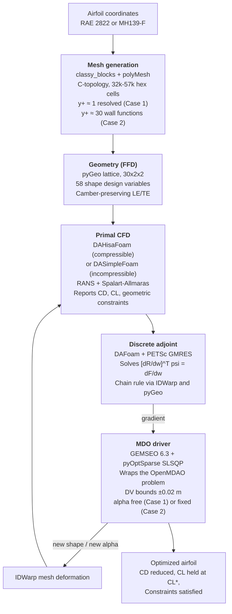

# Adjoint-Based Airfoil Shape Optimization — Pipeline Methodology

An end-to-end open-source aerodynamic shape-optimization pipeline built on a
discrete-adjoint RANS solver and a dual-framework MDO stack (OpenMDAO for the
differentiable discipline graph, GEMSEO for the outer optimizer driver).

**This document describes the pipeline itself — the parts that are shared by
every case study.** Case-specific operating points, results and discussion
live in their own documents:

| Case | Regime | Document |
|---|---|---|
| **1 — RAE 2822** | Transonic: M = 0.729, Re = 6.5 × 10⁶, C_L\* = 0.824, α free | [`CASE_TRANSONIC_RAE2822.md`](CASE_TRANSONIC_RAE2822.md) |
| **2 — MH139-F** | Low-Reynolds: M = 0.0074, Re = 1.67 × 10⁵, C_L\* = 0.975, α fixed at 4.5° | [`CASE_LOWRE_MH139F.md`](CASE_LOWRE_MH139F.md) |

The same mesh generator, FFD parameterization, adjoint formulation and
GEMSEO/OpenMDAO bridge serve both. The two cases differ in the primal solver
(compressible versus incompressible), the fluid model, and whether the angle
of attack is a design variable.

## Scope

**Neither case study is a bit-for-bit reproduction of a published paper.**
Case 1 is exercised at the operating point of He et al. (2019) ADODG Case 2
and its differences from that paper are catalogued in the Case 1 document.
Case 2 is a demonstrator at LALE Reynolds numbers with no external benchmark —
see the Case 2 document for why a literature comparison would be misleading
there.

Claims marked "verified from the paper" cite the specific page of
`He2019c.pdf` where the fact appears. Everything else is an implementation
choice with its reasoning stated.

## Contents

1. [Objectives](#1-objectives)
2. [Software stack](#2-software-stack)
3. [Workflow](#3-workflow)
4. [Components](#4-components)
5. [OpenMDAO + GEMSEO integration](#5-openmdao--gemseo-integration)
6. [Results](#6-results)
7. [Reproducibility](#7-reproducibility)
8. [Limitations](#8-limitations)
9. [References](#9-references)

---

## 1. Objectives

1. Build an end-to-end differentiable aerodynamic design loop using
   open-source software.
2. Use the discrete adjoint of the RANS equations to obtain gradients of
   the drag coefficient with respect to shape design variables at a cost
   independent of the number of design variables.
3. Use GEMSEO as the outer MDO framework while preserving the mature
   OpenMDAO/MPhys integration underneath DAFoam.
4. Demonstrate that the same pipeline transfers across flow regimes by
   running it at two operating points that share nothing physically —
   transonic shock-dominated flow at Re = 6.5 × 10⁶, and incompressible
   low-Reynolds flow at Re = 1.7 × 10⁵ — and honestly assess where each
   result lands.

Non-goals: multipoint optimization, unsteady effects, aeroelastic
coupling, uncertainty quantification, laminar-turbulent transition
modelling. All are natural extensions.

---

## 2. Software stack

Thirteen packages arranged across four layers.

### 2.1 CFD and adjoint core

| Package | Role |
|---|---|
| **OpenFOAM v2506** | Underlying finite-volume CFD framework — mesh format, boundary condition machinery, runtime function objects. |
| **DAFoam v5** | Adds a discrete adjoint layer to OpenFOAM. Provides `DAHisaFoam` (compressible primal), automatic assembly of the transposed residual Jacobian, PETSc-backed GMRES, and the OpenMDAO/MPhys integration hooks. |
| **PETSc4py** | Python bindings for PETSc; supplies the Krylov solvers, sparse matrix operations, and parallel linear algebra that DAFoam uses under the hood. |
| **mpi4py** | MPI bindings enabling parallel decomposition of both primal and adjoint solves across CPU cores. |

### 2.2 Geometry and mesh manipulation

| Package | Role |
|---|---|
| **pyGeo** | Free-Form Deformation with analytic derivatives. Manages design-variable definitions, geometric constraints, and surface embedding. Chosen because it is tightly integrated with DAFoam via MPhys. |
| **IDWarp** | Inverse-Distance Weighted volume-mesh warping under surface deformation. Preserves the near-wall stack (essential for y⁺ ≈ 1 meshes) and provides analytic sensitivities. |

### 2.3 MDO frameworks (both used together — see § 5)

| Package | Role |
|---|---|
| **OpenMDAO** | Component-based MDO framework from NASA/MDOLab. Substrate DAFoam is built on: mesh subsystem, geometry component, aerodynamic scenario, and functionals are all OpenMDAO components. |
| **MPhys** | Multi-physics scenarios built on OpenMDAO. Provides the `Multipoint`, `ScenarioAerodynamic`, and standard adaptors that make the mesh → geometry → warp → CFD → functional path plug together. |
| **GEMSEO** | Multi-Disciplinary Analysis and Optimisation framework from IRT SystemX / Airbus. Provides Discipline abstraction, design-space representation, MDO formulations, scenario execution engine, and post-processing. |
| **gemseo-pyoptsparse** | Bridge plugin: registers pyOptSparse's optimizers inside GEMSEO's algorithm library. |
| **pyOptSparse** | Unified interface to a suite of gradient-based and gradient-free constrained optimizers. Its SLSQP wrapper is well-tested for CFD shape optimization. |

### 2.4 Supporting libraries

`numpy < 2` (pyOptSparse 2.10.1 depends on `np.float_`, removed in NumPy 2),
`scipy`, and Python 3.10 (the interpreter shipped in the DAFoam Docker
image).

---

## 3. Workflow



The airfoil coordinates enter mesh generation. The FFD lattice wraps the
airfoil surface and exposes 58 y-displacement design variables. The
primal solver advances the RANS equations to steady state and integrates
force coefficients. The discrete adjoint delivers exact gradients at
cost independent of the design-variable count. GEMSEO (wrapping the
OpenMDAO problem) proposes a new design via SLSQP and closes the loop by
sending the new shape — and, where it is a design variable, the new angle
of attack — back through IDWarp.

Only two boxes change between the two case studies: the primal solver
(compressible versus incompressible) and whether α is in the design vector.
Everything else is shared code.

---

## 4. Components

### 4.1 Mesh generation

A 2D C-topology hex mesh around the airfoil, converted to OpenFOAM
polyMesh format. Mesh parameters are per-case presets in
`mesh/generate_cmesh.py`; first-cell height is computed from the flow
conditions by `mesh/boundary_layer.py`.

| | Case 1 — transonic | Case 2 — low-Re |
|---|---|---|
| Cells | ~57 k hex | ~32–45 k hex |
| Wall treatment | **Wall-resolved, y⁺ ≈ 1**, no wall functions | **`nutUSpaldingWallFunction`, y⁺ ≈ 30** |
| Far field | ≈ 30 chords | 10 chords |
| LE clustering | full | coarsened (`n_profile_pts` 100, `n_circ_front` 60) |
| BL expansion `C2C_BL` | mesh-quality tuned | 1.12 |

**Choice: C-topology.** Wraps around the LE and trails the wake as
parallel block boundaries. Standard for airfoil CFD.

**Choice: wall-resolved for Case 1.** Adjoint sensitivities to skin-friction
drag are significant at transonic Reynolds. Wall functions would introduce
empirical error that pollutes gradients.

**Choice: wall functions for Case 2 — a compromise, not a preference.** The
same y⁺ ≈ 1 approach was tried first at low Reynolds and abandoned: it
produced leading-edge cells with minimum volumes around 5 × 10⁻¹⁰, which
drove a Spalart-Allmaras production runaway. Switching to
`nutUSpaldingWallFunction` at y⁺ ≈ 30, with a coarser LE cluster and a
10-chord far field, is what made the case run stably. The accuracy cost is
real and is documented in
[`CASE_LOWRE_MH139F.md`](CASE_LOWRE_MH139F.md) § 7.

**Cell count history.** Started at 99k cells with a mild radial expansion
ratio. The adjoint chain-rule step exceeded 28 GB of WSL memory and
caused the container to OOM. Rebuilding with a slightly more aggressive
expansion ratio produced a 57k-cell mesh with unchanged quality metrics
(non-orthogonality 60, skewness 0.40).

Files: `mesh/generate_cmesh.py`, `case/constant/polyMesh/`.

### 4.2 Geometry parameterization

Trivariate B-spline FFD lattice, 30 × 2 × 2 control points. Interior
28 × 2 y-displacements + 2 slaved LE/TE pairs give 58 free shape design
variables.

**Choice: FFD.** Smooth deformation over the whole surface, analytic
`dX/dP`, low-dimensional design vector.

**Camber-preservation constraint.** LE and TE control points are slaved
so their upper and lower siblings move in opposite directions. Removes
two rigid-body y-translation modes.

**Design-variable bounds ±0.02 m (± 2% chord).** Initially set at ±1.0 m
following the DAFoam tutorial defaults, but the first SLSQP descent step
at those bounds destroyed the y⁺ ≈ 1 wall stack. 2% chord is generous by
shape-design standards.

Files: `ffd/generate_ffd.py`, `case/FFD/wingFFD.xyz`, `case/dafoam_model.py`.

### 4.3 Primal CFD

Steady RANS with Spalart-Allmaras closure. **The solver is selected per
case** — this is the one component that genuinely differs between the two
studies.

| | Case 1 — transonic | Case 2 — low-Re |
|---|---|---|
| Solver | `DAHisaFoam` | `DASimpleFoam` |
| Formulation | Density-based, compressible | SIMPLE, incompressible |
| Convective flux | JST | `linearUpwindV` (bounded Gauss) |
| Fields solved | U, p, T, nut, nuTilda, alphat | U, p, nut, nuTilda |
| Pressure variable | Absolute p (Pa) | Kinematic p/ρ (m²/s²) |
| Wall treatment | Wall-resolved, y⁺ ≈ 1 | `nutUSpaldingWallFunction`, y⁺ ≈ 30 |
| Auto-stop | `stdTol = 0.01`, `slopeTol = 5e-5` | `stdTol = 1e-3`, `slopeTol = 5e-6` |

**Choice: density-based for Case 1.** Required for shock capture at M = 0.729.

**Choice: incompressible for Case 2.** Density-based schemes with JST flux
become poorly conditioned as M → 0, and M = 0.0074 is far outside
`DAHisaFoam`'s usable range.

**Choice: Spalart-Allmaras in both.** Standard reference model for airfoil
aerodynamics, and it matches the He 2019 setup for Case 1. For Case 2 it is a
**known simplification** — SA is fully turbulent and cannot represent the
laminar separation bubble that MH-series airfoils exhibit at Re ~ 10⁵. That
limitation compounds with the wall-function treatment (§ 4.1); together they
mean absolute skin-friction drag in Case 2 carries real modelling error. See
the Case 2 document for the consequences.

**Auto-stop tolerances.** `primalMinIters = 8000`, `nStepsFrac = 0.2` in both,
with the per-case `stdTol`/`slopeTol` above. Tuned progressively over many
runs from `100 / 0.1 / 1e-3` upward.

Files: `case/dafoam_model.py`, `case_lale/dafoam_model.py`, `*/system/`,
`*/run_primal.py`.

### 4.4 Discrete adjoint

Solves `[∂R/∂w]ᵀ ψ = ∂F/∂w` for the adjoint state ψ, then applies the
chain rule for total derivatives `dF/dx = ∂F/∂x − ψᵀ ∂R/∂x`.

**Rationale.** For 58 design variables, finite differences would need
59 primal solves per gradient evaluation. The discrete adjoint costs
one linear solve per functional regardless of the design-variable
count.

**Linear solver.** PETSc GMRES, additive Schwarz preconditioner, ILU-1
fill, natural reordering. `gmresRelTol = 1e-6`. Typical GMRES converges
in 600-800 iterations per functional.

**Coloring cache.** DAFoam caches the graph coloring in
`dRdWColoring_<nranks>.bin`. Must be deleted whenever the mesh or FFD
changes.

Files: `case/dafoam_model.py`, `case/verify_gradients.py`.

### 4.5 MDO driver

Solves the constrained non-linear program

```
minimize      CD(s, alpha)
w.r.t.        s in [-0.02, 0.02]^58 m,  alpha in [0, 10] deg   (Case 1)
              s in [-0.02, 0.02]^58 m                          (Case 2, alpha fixed)
subject to    CL(...) = CL*
              thickcon(s) >= 0.5, volcon(s) >= 1.0, rcon(s) >= 0.8
```

via SLSQP from pyOptSparse, driven by GEMSEO, evaluating the OpenMDAO
problem underneath. Details in the next section.

**The α treatment is the second structural difference between the cases.**
In Case 1, α is a design variable, so the optimizer can trade angle of attack
against shape to meet the lift target cheaply. In Case 2 it is a fixed
constraint, and the shape alone must generate the required C_L — which forces
SLSQP to find the feasible set before it can begin minimizing. The design
space branch lives in `mdo/run_optimization.py`; the freestream direction for
Case 2 comes from `case_lale/0_orig/U` rather than a `patchV` design variable.

Files: `mdo/dafoam_discipline.py`, `mdo/run_optimization.py`.

---

## 5. OpenMDAO + GEMSEO integration

The combination of OpenMDAO and GEMSEO in one pipeline is unusual.

### 5.1 Strategic choice

Three options were on the table:

1. **Pure OpenMDAO + pyOptSparse** — what the paper does. Simple.
   Downside: does not fulfil the project's stated goal of using GEMSEO.
2. **Pure GEMSEO** — port DAFoam's discipline set natively to GEMSEO
   Discipline classes. Very substantial engineering effort.
3. **GEMSEO drives OpenMDAO** — wrap the entire OpenMDAO Problem in a
   single GEMSEO Discipline. GEMSEO handles design space, formulation,
   and optimizer. OpenMDAO handles internal derivatives and DAFoam
   integration.

Option 3 was chosen. It preserves DAFoam's mature OpenMDAO integration
and adds GEMSEO's cleaner MDO abstractions on top.

### 5.2 How the frameworks interlock

```
GEMSEO scenario                     OpenMDAO problem
(formulation, design space,         (owned inside the
 optimizer, execute loop)            DAFoamDiscipline)
        |                                    |
        | scenario.execute(algo=...)          | prob.run_model()
        v                                    v
DAFoamDiscipline._run                  MPhys ScenarioAerodynamic
   prob.set_val("shape", s)             mesh (DAFoamBuilder)
   prob.set_val("patchV", ...)          geometry (OM_DVGEOCOMP)
   prob.run_model()                     coupling (DAFoamSolver)
   return {CD, CL, ...}                 aero_post (functionals)

DAFoamDiscipline._compute_jacobian
   prob.compute_totals(of=[...],
                       wrt=[...])       (runs the adjoint per F,
                                        chain rule inside OpenMDAO)
   self.jac[out][in] = totals[...]
```

Key files:

- `mdo/dafoam_discipline.py` - the bridge (~ 60 lines of substantive glue)
- `mdo/run_optimization.py` - the GEMSEO scenario definition
- `case/dafoam_model.py` - the OpenMDAO problem itself

### 5.3 What the bridge does not do

- It does not translate MPhys scenarios into GEMSEO. The OpenMDAO
  problem lives entirely inside the GEMSEO discipline; GEMSEO sees only
  input/output vectors and the analytic Jacobian.
- It does not use GEMSEO's own derivative propagation. All internal
  derivatives (from CD to shape) are computed inside OpenMDAO.
- It does not multiply-instantiate the DAFoam problem. Build once in
  `__init__`; reuse across all optimizer iterations.

### 5.4 API version notes

- GEMSEO 5.x → 6.x rename map: `MDODiscipline` → `Discipline`,
  `local_data` → `io.data`, `default_inputs` → `io.input_grammar.defaults`,
  `_run(self)` + `store_local_data(**out)` → `_run(input_data)` that
  returns a dict, `_init_jacobian(with_zeros=True)` → `_init_jacobian(...)`.
- `gemseo-pyoptsparse` 1.1.1 rejects any pyOptSparse-native setting name
  that has a GEMSEO-canonical counterpart. Pass only `max_iter` plus
  GEMSEO-standard tolerance names.

---

## 6. Results

Results are reported per case study, because the two operating points share
no physics and their headline numbers are not comparable to each other.

| Case | Regime | Headline | Document |
|---|---|---|---|
| **1 — RAE 2822** | Transonic, M = 0.729, Re = 6.5 x 10^6, alpha free | **-26.6 counts (-14.5 %)** cold-start, 183.8 -> 157.2 ct at C_L ~ 0.80 | [`CASE_TRANSONIC_RAE2822.md`](CASE_TRANSONIC_RAE2822.md) |
| **2 — MH139-F** | Low-Re, M = 0.0074, Re = 1.67 x 10^5, alpha fixed | **-14.7 counts (-3.8 %)** at constant lift, 385.2 -> 370.5 ct at C_L = 0.975 | [`CASE_LOWRE_MH139F.md`](CASE_LOWRE_MH139F.md) |

Two cautions apply when reading either number, and both are documented in
full in the respective case files:

- **Case 1** — the raw SLSQP-reported reduction is -20.0 %, but a cold-start
  replay of the optimum gives -14.5 %. The difference comes from DAFoam not
  resetting the turbulence field between primals, which lets warm-started
  transonic solutions settle on a slightly different attractor. The
  cold-start figure is the one quoted everywhere in this repository.
- **Case 2** — the reduction is measured from the *first feasible design*
  (eval 4), not from the undeformed airfoil. Because alpha is fixed, the
  original MH139-F never satisfies the lift constraint, so no
  original-versus-optimized comparison exists. The `dCts` column in that
  run's `opt_summary.md` compares against the infeasible starting point and
  must not be read as a performance regression.

What the pair demonstrates jointly: **the same adjoint pipeline, the same 58
FFD design variables and the same GEMSEO/OpenMDAO bridge produced a
constraint-satisfying descent in two flow regimes separated by a factor of 40
in Reynolds number and a factor of 100 in Mach number**, with only the primal
solver and the design-space definition changed.

---

## 7. Reproducibility

### 7.1 Environment

- Windows 11 host, Docker Desktop with WSL2 backend
- `%USERPROFILE%\.wslconfig`:

  ```ini
  [wsl2]
  processors=12
  memory=24GB
  swap=32GB
  ```

- `docker run` flags: `--memory=28g --memory-swap=60g`
- Docker base image: `dafoam/opt-packages:latest`, snapshotted after
  installing GEMSEO as `dafoam-gemseo:latest` (`docker commit`) so pip
  installs do not need to be repeated.

### 7.2 One-time container setup

```bash
docker run -it --rm -u dafoamuser --memory=28g --memory-swap=60g \
    --mount "type=bind,src=$(pwd),target=/home/dafoamuser/mount" \
    -w /home/dafoamuser/mount \
    dafoam/opt-packages:latest bash

# Inside the container:
pip install "numpy<2"
pip install "gemseo[all]>=6.3,<7"
pip install git+https://gitlab.com/gemseo/dev/gemseo-pyoptsparse.git@1.1.1

# Verify:
python -c "from gemseo import get_available_opt_algorithms; \
  print([a for a in get_available_opt_algorithms() if 'PYOPT' in a.upper()])"
# Expected: ['PYOPTSPARSE_SLSQP', 'PYOPTSPARSE_SNOPT']

# Snapshot for reuse (from Windows PowerShell in another terminal):
docker ps
docker commit <container_id> dafoam-gemseo:latest
```

Subsequent sessions:

```bash
docker run -it --rm -u dafoamuser --memory=28g --memory-swap=60g \
    --mount "type=bind,src=$(pwd),target=/home/dafoamuser/mount" \
    -w /home/dafoamuser/mount \
    dafoam-gemseo:latest bash
```

### 7.3 Run sequence

The shape of the sequence is identical for both cases; only the case
directory and the `--preset` flag change.

| | Case 1 — transonic | Case 2 — low-Re |
|---|---|---|
| Case directory | `case/` | `case_lale/` |
| Preset | `benchmark` | `lale` |
| MPI ranks used | 4 | 6 |
| Baseline primal | ≈ 2 h | ≈ 5 min |
| Optimization | ≈ 27 h at `max-iter 10` | ≈ 8.6 h at `max-iter 50` |

Outside the container (WSL, standard Python venv):

```bash
python mesh/generate_cmesh.py --case <CASEDIR> --preset <PRESET> --run
checkMesh -case <CASEDIR>
cd ffd && python generate_ffd.py --case ../<CASEDIR> && cd ..
head -3 <CASEDIR>/FFD/wingFFD.xyz   # confirm "30 2 2"
```

Inside the container:

```bash
cd <CASEDIR>
rm -f dRdWColoring_*.bin opt_log.txt opt_summary.md
rm -rf processor* 0 postProcessing
cp -r 0_orig 0

# Baseline sanity primal:
mpirun -np <N> python -u run_primal.py --preset <PRESET> > baseline.log 2>&1

# Full optimization:
mpirun -np <N> python -u ../mdo/run_optimization.py \
    --preset <PRESET> --algo PYOPTSPARSE_SLSQP --max-iter <M> \
    > opt_log.txt 2>&1 &
tail -f opt_log.txt

# Second WSL terminal for live per-iteration summary:
tail -f <CASEDIR>/opt_summary.md
```

Concrete invocations for each case are in
[`CASE_TRANSONIC_RAE2822.md`](CASE_TRANSONIC_RAE2822.md) § 9 and
[`CASE_LOWRE_MH139F.md`](CASE_LOWRE_MH139F.md) § 8.

### 7.4 Cleanup between runs

Whenever the mesh or FFD changes:

```bash
cd <CASEDIR>
rm -f dRdWColoring_*.bin dRdWPCMat_*.bin
rm -rf processor* 0
cp -r 0_orig 0
rm -f opt_log.txt opt_summary.md
```

The `dRdWColoring_*.bin` cache **must** be deleted whenever the mesh or FFD
lattice changes, and is also rank-count specific — switching between 4 and 6
MPI ranks invalidates it.

### 7.5 Archiving a completed run

```bash
python mdo/archive_run.py --case <CASEDIR>
```

Writes a timestamped tree under `results/` containing the run configuration,
mesh topology, final flow field, per-evaluation design vectors, optimization
history and a `MANIFEST.md`. Large regenerable artefacts (processor
decompositions, `polyMesh`, `opt_history.h5`, raw logs) are excluded from
version control by `.gitignore` but retained on disk.

---

## 8. Limitations

These apply to the pipeline itself and therefore to both case studies.
Case-specific limitations are listed in each case document.

- **Adjoint gradient accuracy is limited by primal convergence, not by
  code.** `verify_gradients.py` at optimization-grade tolerances shows
  meaningful FD/adjoint disagreement. Reaching publication-quality
  verification requires `stdTol = 1e-3` and about 15 000 primal
  iterations, which was out of budget for both cases.
- **The blunt TE.** `classy_blocks` needs a non-zero TE thickness, so
  `mesh/airfoil_io.py:thicken_te()` adds ≈ 1 % chord of blunt base.
  Consequences: small base pressure that raises C_D by 3–8 counts, and a
  Cp-plot artefact near the TE (see [`CP_PLOT_NOTES.md`](CP_PLOT_NOTES.md)).
- **Reported C_D can depend on optimization history.** DAFoam's
  `primalInitCondition` resets U, p and T between iterations but not the
  turbulence field ν̃, so a warm-started primal may settle on a different
  attractor than a cold start at the same geometry. This bit Case 1 hard
  (≈ 10 counts, see its § 5); it is a smaller effect in the shock-free
  low-Reynolds case.
- **Two-dimensional emulation** via a single-cell spanwise slab. Adequate
  for both airfoil studies; a 3D wing would need fresh mesh topology.
- **Both runs terminated on `max_iter`, not on a KKT optimality test.**
  Neither result should be read as a converged optimum.
- **Single-point optimization only.** No off-design or multipoint
  evaluation, so neither optimum is checked for robustness away from its
  design condition.
- **No transition modelling.** Spalart-Allmaras is fully turbulent. This is
  standard practice at transonic Reynolds numbers but is a material
  simplification at Re ~ 10⁵ — see the Case 2 document.
- **Wall treatment is not uniform across the cases.** Case 1 is wall-resolved;
  Case 2 uses wall functions at y⁺ ≈ 30 for mesh-stability reasons (§ 4.1).
  Absolute drag levels between the two cases are therefore **not** directly
  comparable, and neither is intended to be.
- **No mesh- or domain-independence study** was performed for either case.
  Cell counts and far-field extents were chosen for stability and runtime,
  not established by refinement.

---

## 9. References

- He, X., Mader, C.A., Martins, J.R.R.A., Maki, K.J. (2019).
  *Robust aerodynamic shape optimization — from a circle to an airfoil*,
  Aerospace Science and Technology, 87, 483-502.
- Gill, P.E., Murray, W., Saunders, M.A. (2005). *SNOPT: An SQP Algorithm
  for Large-Scale Constrained Optimization*. SIAM Review, 47(1), 99-131.
- Jameson, A., Schmidt, W., Turkel, E. (1981). *Numerical solutions of
  the Euler equations by finite volume methods using Runge–Kutta
  time-stepping schemes*. AIAA Paper 81-1259.
- Sederberg, T.W., Parry, S.R. (1986). *Free-Form Deformation of Solid
  Geometric Models*. SIGGRAPH, 20(4), 151-160.
- Spalart, P.R., Allmaras, S.R. (1992). *A One-Equation Turbulence Model
  for Aerodynamic Flows*. AIAA Paper 92-0439.
- Oettershagen, P., Melzer, A., Mantel, T., Rudin, K., Stastny, T.,
  Wawrzacz, B., Hinzmann, T., Leutenegger, S., Alexis, K., Siegwart, R.
  (2017). *Design of small hand-launched solar-powered UAVs: From concept
  study to a multi-day world endurance record flight*. Journal of Field
  Robotics, 34(7), 1352-1385. DOI: 10.1002/rob.21717.
- DAFoam: https://dafoam.github.io/
- ADflow: https://mdolab-adflow.readthedocs-hosted.com/
- OpenMDAO: https://openmdao.org/
- MPhys: https://openmdao.github.io/mphys/
- GEMSEO: https://gemseo.readthedocs.io/
- gemseo-pyoptsparse: https://gitlab.com/gemseo/dev/gemseo-pyoptsparse
- pyOptSparse: https://mdolab-pyoptsparse.readthedocs-hosted.com/
- pyGeo: https://github.com/mdolab/pygeo
- IDWarp: https://github.com/mdolab/idwarp

### Companion documents in this repository

**Case studies**

- [`CASE_TRANSONIC_RAE2822.md`](CASE_TRANSONIC_RAE2822.md) — Case 1: RAE 2822
  at M = 0.729, results and comparison to He et al. (2019).
- [`CASE_LOWRE_MH139F.md`](CASE_LOWRE_MH139F.md) — Case 2: MH139-F at
  Re = 1.67 × 10⁵, results and limitations.
- [`LALE_PROBLEM.md`](LALE_PROBLEM.md) — operating-point derivation and
  implementation plan for Case 2.

**Notes and tooling**

- [`WORKFLOW.md`](WORKFLOW.md) — workflow diagram (Mermaid + text)
- [`CP_PLOT_NOTES.md`](CP_PLOT_NOTES.md) — Cp extraction algorithm and
  blunt-TE handling
- [`CHANGES_LOG.md`](CHANGES_LOG.md) — chronological record of pipeline changes
- `plot_cp.py` — post-processing script for Cp and shape plots
- `make_history_plots.py` — C_D / C_L / constraint history plots
