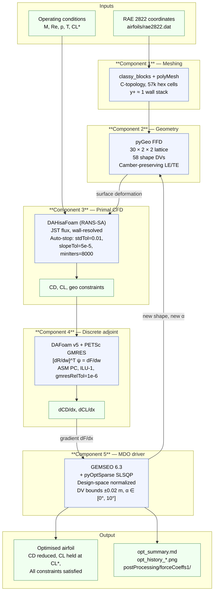

# Workflow Diagram

Both a rendered Mermaid diagram and a plain-text version are provided so the
workflow is legible whether the reader is on GitHub, in a plain terminal, or
in a printout.

## Which case is drawn here

The diagrams below are drawn with **Case 1 (RAE 2822, transonic)** parameters
filled in. The pipeline structure is identical for **Case 2 (MH139-F,
low-Reynolds)**; only the values inside Components 1, 3 and 5 change:

| Component | Case 1 — RAE 2822 | Case 2 — MH139-F |
|---|---|---|
| 1 — Meshing | 57 k cells, y⁺ ≈ 1 wall-resolved, 30 c far field | 32–45 k cells, y⁺ ≈ 30 wall functions, 10 c far field |
| 2 — Geometry | 30 × 2 × 2 FFD, 58 shape DVs | identical |
| 3 — Primal | `DAHisaFoam`, compressible, JST flux | `DASimpleFoam`, incompressible SIMPLE |
| 4 — Adjoint | DAFoam + PETSc GMRES | identical |
| 5 — MDO driver | GEMSEO + SLSQP, DVs = shape + α | GEMSEO + SLSQP, DVs = shape only (α fixed at 4.5°) |

Full details: [`CASE_TRANSONIC_RAE2822.md`](CASE_TRANSONIC_RAE2822.md) and
[`CASE_LOWRE_MH139F.md`](CASE_LOWRE_MH139F.md).

## Mermaid (renders on GitHub, GitLab, VS Code preview, and modern markdown viewers)



## Text version

```
                    Inputs
      RAE 2822 coordinates      Operating conditions
             |                          |
             v                          |
   +---------+----------+               |
   | Component 1        |               |
   | Meshing            |               |
   | -------            |               |
   | classy_blocks +    |               |
   | polyMesh           |               |
   | C-topology,        |               |
   | 57k hex cells,     |               |
   | y+ ≈ 1 wall stack  |               |
   +---------+----------+               |
             |                          |
             v                          |
   +---------+----------+               |
   | Component 2        |               |
   | Geometry           |               |
   | ---------          |               |
   | pyGeo FFD          |               |
   | 30 × 2 × 2 lattice |<-------\      |
   | 58 shape DVs       |         \     |
   +---------+----------+          \    |
             |                      \   |
             | (deformed surface)    \  |
             v                        \ |
   +---------+----------+              \|
   | Component 3        |               |
   | Primal CFD         |<--------------+
   | ----------         |
   | DAHisaFoam RANS-SA |
   | JST flux           |
   | Auto-stop:         |     produces
   | stdTol=0.01        |------------------> CD, CL,
   | slopeTol=5e-5      |                     thickcon, volcon, rcon
   | minIters=8000      |
   +---------+----------+
             |
             v
   +---------+----------+
   | Component 4        |
   | Discrete Adjoint   |
   | ----------------   |
   | DAFoam v5 +        |
   | PETSc GMRES        |
   | [dR/dw]^T ψ =      |     produces
   | dF/dw              |------------------> dCD/dx, dCL/dx,
   | ASM PC, ILU-1,     |                     dConstr/dx
   | gmresRelTol=1e-6   |
   +---------+----------+
             |
             | (gradient dF/dx)
             v
   +---------+----------+
   | Component 5        |
   | MDO Driver         |----------\
   | ----------         |           \
   | GEMSEO 6.3         |            \  (new shape, new α)
   | pyOptSparse SLSQP  |             \    feeds back to Component 2
   | Bounds ±0.02 m,    |              \
   | α ∈ [0°, 10°]      |               '---> loop back
   | CL equality        |
   | Geom inequalities  |
   +---------+----------+
             |
             | (converged optimum)
             v
   +---------+----------+
   | Optimised airfoil  |
   | ----------------   |
   | CD reduced         |
   | CL held at target  |
   | Constraints PASS   |
   | opt_summary.md,    |
   | history plots,     |
   | force-coeff CSV    |
   +--------------------+
```

## Iteration loop

Each SLSQP outer iteration performs the following inner sequence:

1. **State update**: SLSQP writes new `shape` and `aoa` values to the discipline.
2. **Mesh warp**: IDWarp (called from inside DAFoam) propagates the FFD-driven
   surface displacement into the volume mesh via inverse-distance weighting.
3. **Primal solve**: DAHisaFoam iterates until CD statistics (std, slope) fall
   below tolerance or `endTime` is reached. Reports CD, CL, geometric
   constraint values.
4. **Adjoint solve**: For each functional (CD, CL, thickcon, volcon, rcon),
   DAFoam builds the adjoint system and solves it with PETSc GMRES. Applies
   the chain rule to produce total derivatives w.r.t. shape and α.
5. **Descent step**: SLSQP receives the gradients, checks KKT residual, and
   proposes the next `shape` and `aoa`. If a line-search fallback is needed,
   additional primal evaluations may occur at intermediate points.
6. **Termination**: The loop exits when either `max_iter` outer iterations
   have been performed, KKT convergence is signalled, or all standard
   pyOptSparse tolerances (ftol_rel, xtol_rel) are satisfied.

## Runtime breakdown (for reference)

### Case 1 — RAE 2822, transonic

| Phase | Wall time (57k cells, 4 MPI ranks) |
|---|---:|
| Container init, DAFoam startup | ~30 s |
| Mesh decomposition (`decomposePar`) | ~5 s |
| Primal (8000 iters) | ~90-140 min |
| Coloring + preconditioner assembly | ~2 min |
| Adjoint per functional (~600 GMRES iters) | ~10-15 min |
| Chain rule for shape + patchV | ~1 min |
| SLSQP overhead (per outer iter) | < 5 s |
| **Total per SLSQP outer iteration** | **~130-180 min** |
| **Total for max_iter=5** | **~11-15 hours** |
| **Total for max_iter=10** | **~22-30 hours** |

### Case 2 — MH139-F, low-Reynolds

Measured from the 50-evaluation run archived at
`results/case_lale_20260806_084558/`:

| Phase | Wall time (32-45k cells, 6 MPI ranks) |
|---|---:|
| Primal (one evaluation) | ~4-7 min |
| **Average per primal, incl. adjoint amortized** | **~10.3 min** |
| **Total: 50 primals + 27 adjoints** | **8 h 37 m** |

Roughly **15× cheaper per evaluation than Case 1** — the mesh is smaller, the
incompressible SIMPLE solve is cheaper than the density-based transonic
primal, and there is no shock to resolve.
